# VTuneHub Phase 1 機能仕様書

## 1. 概要

本ドキュメントでは、VTuneHub Phase 1（MVP）システムの各機能について技術的な詳細仕様を定義します。要求仕様書で定義された要件を基に、各機能が提供すべき振る舞いを記述します。

VTuneHub Phase 1 (MVP)は、VTuberが自身のスケジュールを管理し、それをリスナーに公開することを主要機能とします。VTuber向けのWebアプリを用いてスケジュールを管理します。スケジュールはもうひとつのWebアプリを用いてユーザーに公開されます。

VtuneHubは、Cloudflareの各サービスを用いたSPAとして実装されます。SPAはReact Routerを用いて実装され、Pagesにより配信されます。APIはCloudflare Workers + Honoにより実現されます。認証にはemailベースのMagic Linkを使い、セッショントークンはJWTで実現され、スケジュールはD1に格納されます。レート制限や一時的に使う認証トークンはDurable Objectに格納されます。秘密鍵はKVに格納します。

VtuneHubは配信スケジュール管理システム・配信スケジュール公開システム・認証APIシステム・管理APIシステム・公開APIシステムの5種類のシステムからなります。VTuber向けのWebアプリのフロントエンドが「配信スケジュール管理システム」で、そのバックエンドをなすAPIが「認証APIシステム」と「管理APIシステム」です。一方、リスナー向けのWebアプリのフロントエンドが「配信スケジュール公開システム」で、そのバックエンドをなすAPIが「公開APIシステム」です。画面が存在するのは、フロントエンドである「配信スケジュール管理システム」と「配信スケジュール公開システム」です。

## 2. アーキテクチャ

### 2.1 システムブロック図

#### 2.1.1 VTuber向けシステム
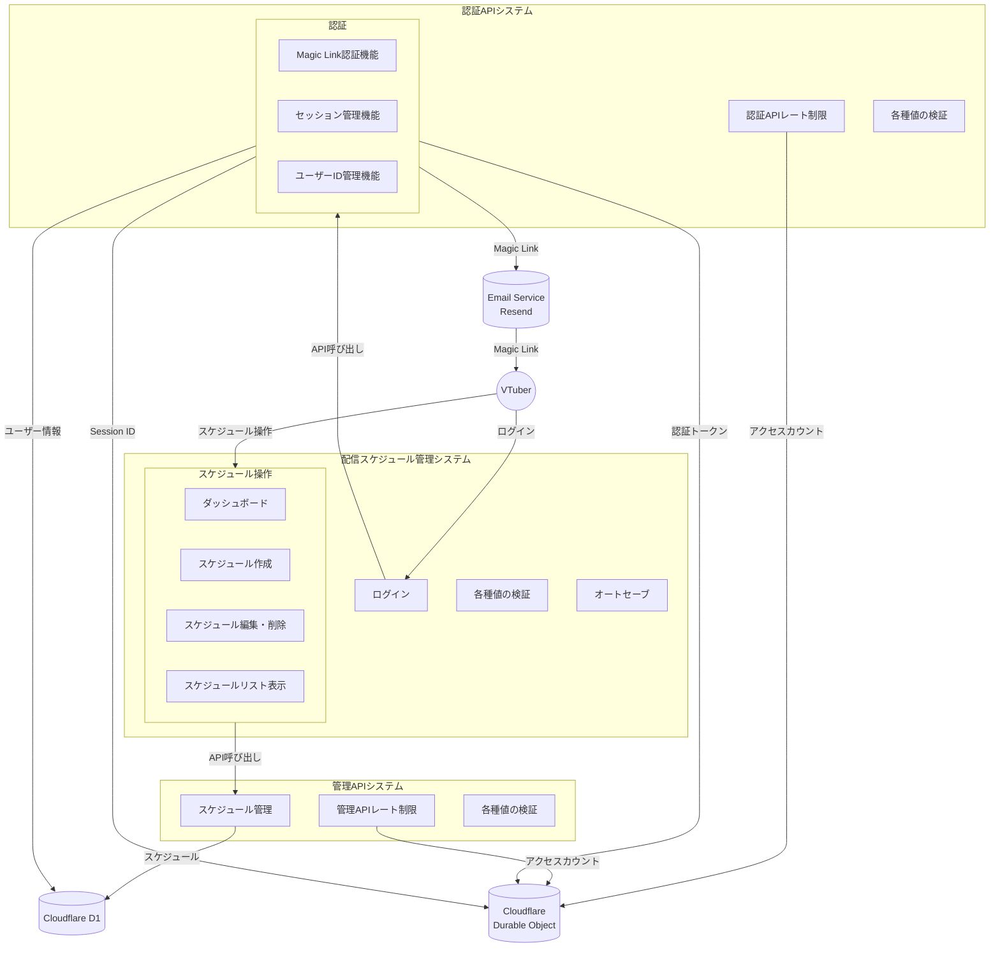


#### 2.2.2 リスナー向けシステム
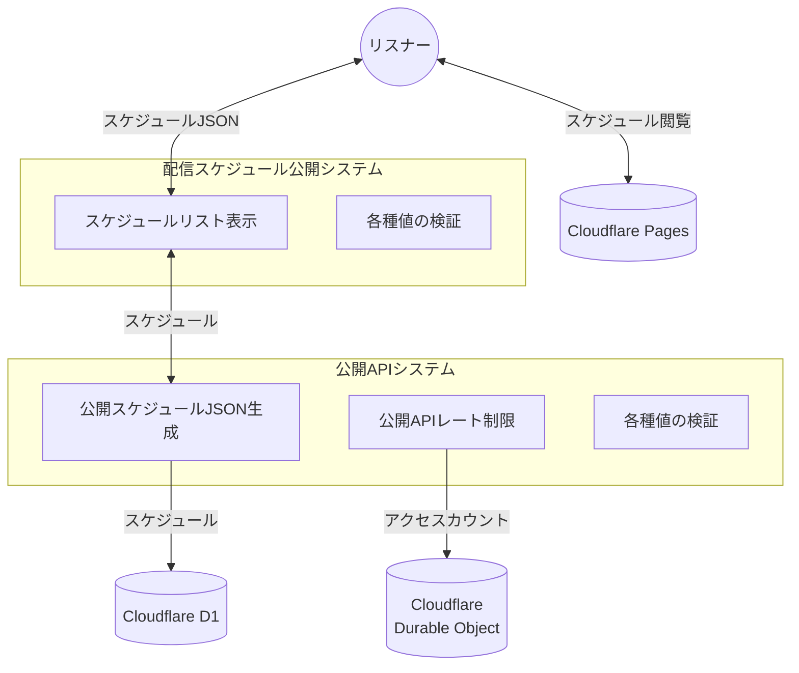


### 2.2 画面遷移図

#### 2.2.1 VTuneHub (VTuber用画面)
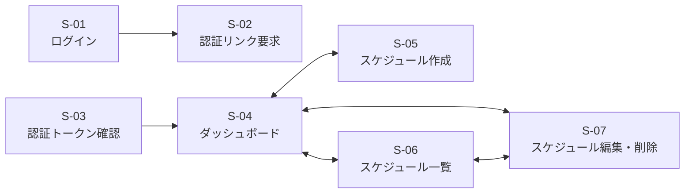

#### 2.2.2 リスナー用画面
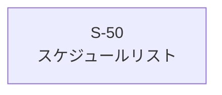

### 2.3 シーケンス図

#### 2.3.1 認証フロー

VTuneHubの認証はMagic Linkを使います。Magic Linkに埋め込む認証トークンはJWT形式です。

1. VTuberがログイン画面にアクセスする。フォームに自分のメールアドレスを入力してSubmitを押下する
1. VTuneHubのSPAは、emailアドレスのバリデーションを行った後に、magic-link APIを呼び出す
1. emailアドレスのバリデーションとレート制限チェックを行う
1. emailアドレスを識別子(subフィールド)とした認証トークン(JWT)を生成し、それをMagic Linkに埋め込み、外部email送信サービスに送る
1. 外部email送信サービスは、Magic Linkの書かれたメールをVTuberに送付する
1. VTuberは、届いたメールに書いてあるMagic Linkをクリックして訪問する
1. Magic Link中の認証トークン(JWT)をバリデーション(文字列長)し、verify APIを呼び出す
1. 認証トークンのバリデーション(文字列長)を行う
1. 認証トークンをベリファイし、有効な認証トークンであることを確認する。同じ認証トークンの再利用もここではじく
1. 認証トークンをデコードして識別子(sub)に設定されているemailアドレスを抽出する
1. emailアドレスに対しレート制限チェックを行う
1. emailアドレスにより指定されたユーザーのユーザーIDをD1から取得する。D1に登録がなければ、ユーザーIDを新たに生成してemailアドレスとともにD1に格納する
1. ユーザーIDを識別子(subフィールド)としたセッショントークン(JWC)を生成する。生成日時とAPI起動回数(0)をトークンに含める
1. 生成したトークンはhttpOnly Cookieとしてブラウザに渡す。正しいトークンがAPIリクエストと共に提供される限り、APIへのアクセス認可を出し続ける。

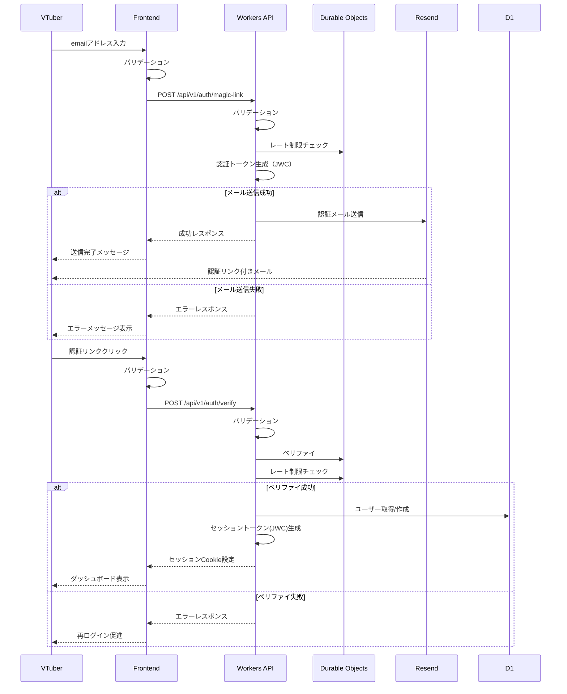

#### 2.3.2 レート制限チェックフロー

1. Durable Object(再)起動時に、state.storageの内容をMapにコピーしてオンメモリにする
1. 与えられたキーを用いてレート制限オブジェクトを取得する
1. レート制限オブジェクトの有効期限を確認する。有効期限切れの場合は、新たにレート制限オブジェクトを生成する
1. レート制限オブジェクト内のレート値をインクリメントし、レートが制限以内か確認する
1. 前項で更新したレート制限オブジェクト使ってMapを更新する。同時にstate.storageへの同じ値の書き込みも行う
1. レート制限チェック成功を返す

成功・失敗にかかわらず、レスポンスを返す前に常に以下のクリーンナップを行います。

7. Mapをスキャンし、期限切れのレート制限オブジェクトのエントリ自体を削除する。同時に、state.storage上のエントリも削除する


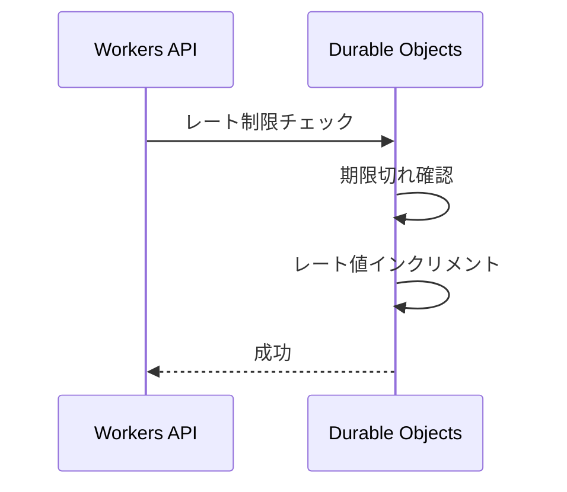

#### 2.3.3 認証トークンのベリファイフロー

1. Durable Object(再)起動後に、state.storage(使用済みストア)の内容をMapにコピーしてオンメモリにする
1. JWTのヘッダをBASE64URLデコードし、JSONオブジェクトに変換する
1. JWTデータ構造で暗号化手法が秘密鍵と一致することを確認する
1. KVから秘密鍵を取得する
1. 秘密鍵を使って署名を生成する。生成した署名がJWCに埋め込まれた署名と一致するかを確認する
1. JWTのペイロードをBASE64URLデコードし、トークンが期限切れでないかを確認する
1. MapからJWT自体をキーとして、値が存在しないことを確認する
1. MapにJWT自体をキーとして、現在時刻を値として書き込む。同時にstate.storageへの同じ値の書き込みも行う

成功・失敗にかかわらず、レスポンスを返す前に常に以下のクリーンナップを行います。

9. Mapをスキャンし、期限切れのトークンのエントリ自体を削除する。同時に、state.storage上のエントリも削除する

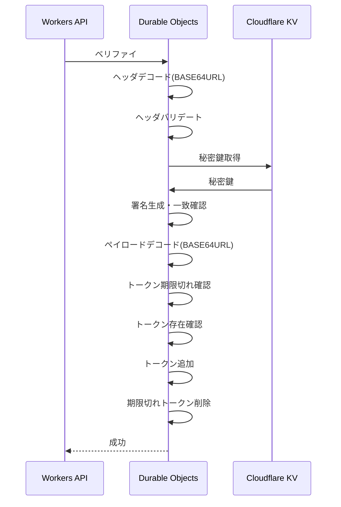


#### 2.3.4 スケジュール更新フロー
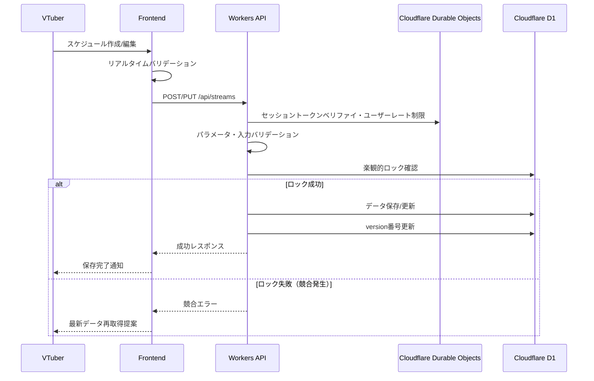

#### 2.3.5 セッショントークンのベリファイ・ユーザーレート制限フロー

セッショントークンのレート制限においては、データ数はユーザー数以上には増えないため、クリンナップは省きます。

1. Durable Object(再)起動後に、state.storage(ユーザーレート制限ストア)の内容をMapにコピーしてオンメモリにする
1. JWTのヘッダをBASE64URLデコードし、JSONオブジェクトに変換する
1. JWTデータ構造で暗号化手法が秘密鍵と一致することを確認する
1. KVから秘密鍵を取得する
1. 秘密鍵を使って署名を生成する。生成した署名がJWCに埋め込まれた署名と一致するかを確認する
1. JWTのペイロードをBASE64URLデコードし、トークンが期限切れでないかを確認する
1. Mapを使い、ユーザーIDベースのレート制限を行う
1. デコード済みペイロードを返却します

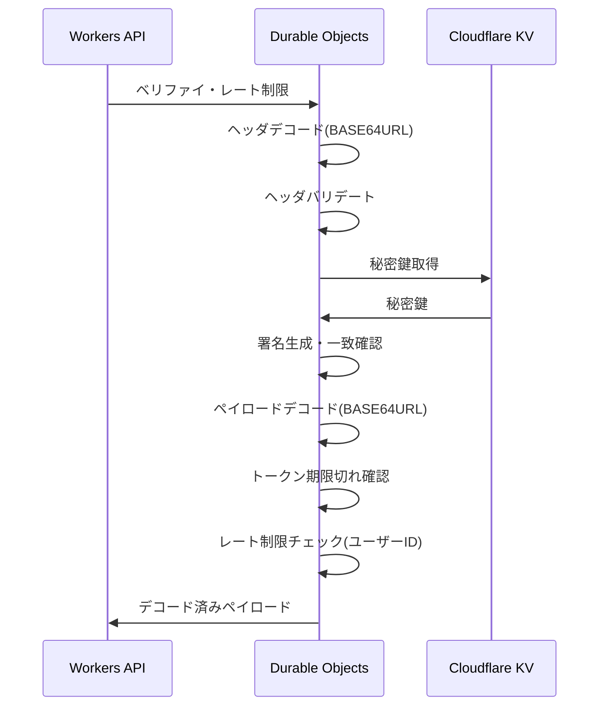


#### 2.3.6 エラー処理フロー
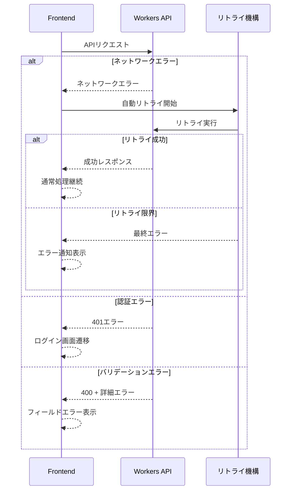

#### 2.3.7 公開スケジュール閲覧フロー
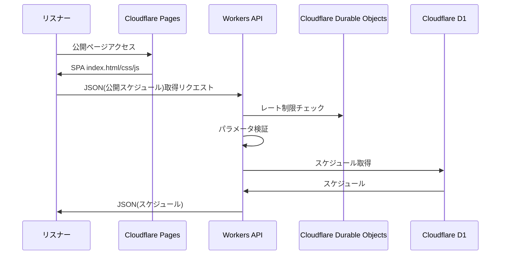


### 2.4 データモデル

#### 2.4.1 データベーススキーマ（D1）

##### users テーブル
```sql
CREATE TABLE users (
  user_id TEXT PRIMARY KEY,
  email TEXT UNIQUE NOT NULL,
  created_at INTEGER NOT NULL,
  deleted_at INTEGER
);
CREATE INDEX idx_users_email ON users(email);
CREATE INDEX idx_users_deleted_at ON users(deleted_at);
```

##### streams テーブル
```sql
CREATE TABLE streams (
  stream_id TEXT PRIMARY KEY,
  user_id TEXT NOT NULL,
  title TEXT NOT NULL,
  will_start_at INTEGER NOT NULL,
  will_end_at INTEGER NOT NULL,
  platform TEXT NOT NULL,
  stream_type TEXT NOT NULL,
  description TEXT,
  tags TEXT, -- JSON文字列として格納
  state INTEGER NOT NULL DEFAULT 0,
  version INTEGER NOT NULL DEFAULT 1, -- 楽観的ロック用
  created_at INTEGER NOT NULL,
  updated_at INTEGER NOT NULL,
  deleted_at INTEGER
  CONSTRAINT chk_time_order CHECK (will_start_at < will_end_at)
);
CREATE INDEX idx_streams_user_id ON streams(user_id);
CREATE INDEX idx_streams_deleted_at ON streams(deleted_at);
CREATE INDEX idx_streams_user_time ON streams(user_id, will_start_at, will_end_at);
```

#### 2.4.2 Durable Objectsストレージ構造

##### 認証トークンペイロード(JWT)
```typescript
interface AuthTokenPayload {
  sub: string;  // userのemailアドレス
  exp: number; // 有効期限（unix time）
}
```

##### セッショントークンペイロード
```typescript
interface SessionTokenPayload {
  sub: string; // user id(UUIDv4)
  exp: number; // 有効期限（unix time）
}
```

##### レート制限
```typescript
// Key: rate:auth:email:{email}
// Key: rate:api:ip:{ip}
// Key: rate:api:user:{user_id}
interface RateLimit {
  count: number;
  reset_at: number; // unix time
}
```
#### 2.4.3 D1に準じたデータ構造

##### UserData - usersテーブルのエントリに該当
```typescript
interface UserData {
  user_id: string;
  email: string;
  created_at: number; // Unix timestamp
  deleted_at: number | null; // Unix timestamp
}
```

##### Stream - streamsテーブルのエントリに相当
```typescript
interface Stream {
  user_id: string;    // UUIDv5
  stream_id: string;  // UUIDv7
  info: StreamInfo;
  state: StreamState;
  version: number; // 楽観的ロック用
  created_at: number; // Unix timestamp
  updated_at: number; // Unix timestamp
  deleted_at: number | null;  // Unix timestamp
}

interface StreamInfo {
  title: string;
  will_start_at: number;  // Unix timestamp (UTC)
  will_end_at: number;    // Unix timestamp (UTC)
  platform: Platform;
  stream_type: StreamType;
  description: string;
  tags: string[]; // 正規化済み（小文字、重複排除）
}

type StreamState = 0 | 1 | 2; // 未公開・未確定 | 未公開・確定 | 公開
type Platform = 'youtube' | 'twitch' | 'niconico';
type StreamType = 'chat' | 'game' | 'singing' | 'collab';
```

**Stream.state 状態遷移**

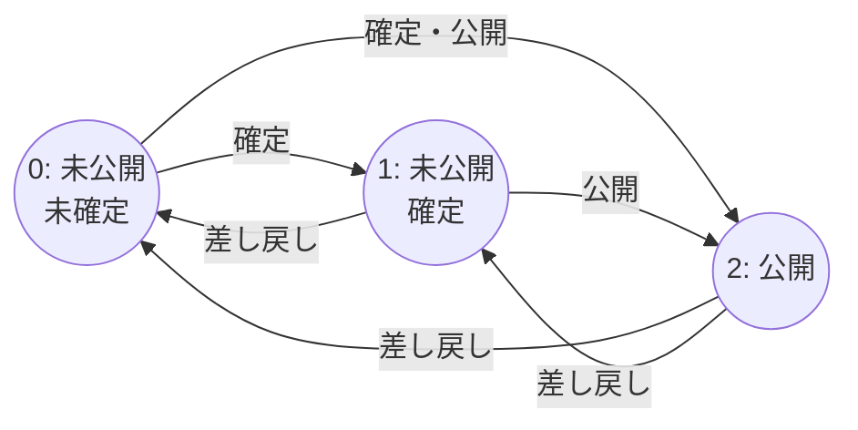

**時間重複チェック仕様**
- 同一ユーザーの配信で時間帯が重複する場合はエラー
- 重複判定条件: `(A.start < B.end) AND (B.start < A.end)`
- 削除済み（deleted_at != null）のレコードは重複チェック対象外

**タグ正規化ルール**
- staticseekの前処理準拠の正規化を行う
- 前後の空白削除: `tag.trim()`
- 重複排除: 配列内で同一タグは1つのみ
- 空文字列は除外

##### PublicStreams - 配信スケジュール公開サイト向けのJsonファイルの型
```typescript
interface PublicStreams {
  generated_at: string; // ISO 8601形式
  streams: PublicStream[];
}

interface PublicStream {
  stream_id: string;
  info: StreamInfo;
}
```

##### StreamOnCreate - スケジュール作成のAPI呼び出しの際に利用
```typescript
interface StreamOnCreate {
  info: StreamInfo;
  state: StreamState;
}
```

#### 2.4.4 APIインタフェース用型定義

##### APIResponse - レスポンス用・ステータスのみ
```typescript
interface APIResponse {
  status: number;
  message?: string; // ユーザー向けメッセージ
  error_cause?: APIErrorResponse;
}

interface APIErrorResponse {
  status: number;
  rate_limit_reset_date?: string; // ISO 8601形式
  missing_fields?: string[];  // field name
  unknown_fields?: string[];  // field name
  invalid_values?: APIInvalidValue[];
}

interface APIInvalidValue {
  field_name: string;
  invalid_cause: string;
  current_value?: any; // デバッグ用（本番では除去）
}
```

##### APIResponseWithBody - レスポンス用・ステータス+任意型のBODY
```typescript
interface APIResponseWithBody<T> {
  status: number;
  error_cause?: APIErrorResponse;
  resp_body: T;  
}
```

##### PaginationMeta - ページネーション情報
```typescript
interface PaginationMeta {
  last_page: number;
  total_items: number;
  items_per_page: number;
}
```


## 3. 機能仕様

### 3.1 フロントエンド(SPA)

#### 3.1.1 配信スケジュール管理システム

VTuberが配信予定を管理し、リスナーに公開するための中核システムです。React Routerを用いたSPAとして実装され、静的ファイル（index.html, .js, .css等）のホスティングはCloudflare Pagesで行います。

---

**◆ ログイン機能 ◆**
- **機能ID**: F-01-0001
- **対応機能要件**: 
- **対応ユーザーストーリー**: 
- **対応画面**: S-01, S-02, S-03

**概要**: ユーザーからのログイン要求を処理します。emailアドレスの入力を促し、そのアドレスにMagic Linkを送信します。Magic Linkをユーザーがクリックすることでログインを行い、ダッシュボードに遷移します。失敗した場合はログイン画面に遷移し、エラーメッセージも共に表示します。

**提供する機能**:
- **ログイン画面(S-01)表示**: VTuberがログインするために使います。メールアドレスをフォームに入力しLoginボタンを押下すると、magic-link APIによる認証リンク要求を行います。要求中で、APIレスポンスが帰ってきてない間はローディング表示をします。
- **認証リンク要求(S-02)**: VTuberが入力したメールアドレスに一時的な認証リンクを送信します。再送信ボタンによるリトライも実装します
- **送信状態管理**: ローディング表示、メール送信が成功/失敗メッセージ
- **認証確認(S-03)**: VTuberがMagic Linkをクリックした時に表示される画面です。表示直後にverify APIを呼び出し、認可がおりた場合にダッシュボードに遷移します。

**画面遷移**
- **S-01でLoginボタンを押下** -> magic-link API呼び出しに成功した場合、S-02に遷移。失敗した場合はエラーメッセージと共にS-01に留まる
- **S-03** -> verify API呼び出しに成功した場合、ダッシュボード(S-04)に遷移。失敗した場合はS-01に遷移し、遷移先でエラーメッセージを出す。

**当該機能特有のエラー表示**
- **ログイン画面(S-01)**
  - **emailサーバーへのアクセス失敗**
    - **条件**: magic-link APIが6(外部サーバー応答なし)を返した場合
    - **対応**: エラーメッセージを表示する。ワイヤーフレーム参照。×を押すとログイン画面に戻る

---
**◆ ダッシュボード機能 ◆**
- **機能ID**: F-01-0002
- **対応機能要件**: 
- **対応ユーザーストーリー**: 
- **対応画面**: S-04

**概要**: ログイン直後のメイン画面としてのダッシュボードを表示します。直近のスケジュールを表示し、各種操作への導線を提供します。

**提供する機能**:
- **ダッシュボード(S-04)表示**: 直近3個のスケジュールをカードのリスト形式で表示します。上が直近で、下が未来です。スケジュールが存在しない場合は、存在しない旨を表示します。
- **スケジュール削除**: カードに存在する削除ボタンを押下された場合は、スケジュールを論理削除しD1に書き込みます。論理削除はdeleted_atフィールドに日付を入力することにより実現します。削除前に警告を出します。
- **ログアウト**: Logoutボタンを押された場合は、セッショントークンをCookieから削除してログアウトします。ログアウト後はlogin画面に遷移します。

**画面遷移**
- **新規作成ボタンを押下** -> スケジュール作成画面(S-06)
- **スケジュール表示ボタンを押下** -> スケジュールリスト画面(S-04)
- **カードに存在する編集ボタンを押下** -> スケジュール編集・削除画面(S-05)

**スケジュールデータ構造**: Stream型 (2.3.3 Stream 参照)

**表示データ**:
- **今後3件のスケジュール**: 現在時刻以降の配信予定
- **配信状態の視覚的表現**: 未確定/確定/公開の状態を色分け
- **プラットフォームアイコン**: YouTube/Twitch/ニコニコ
- **残り時間表示**: 配信開始までの時間

**クイックアクション**:
- **編集**: スケジュール編集画面へ
- **状態変更**: 公開/非公開の切り替え(Phase1は未実装)
- **削除**: 確認ダイアログ後に論理削除
- **複製**: 既存スケジュールをベースに新規作成(Phase1は未実装)

---
**◆ スケジュール作成機能 ◆**
- **機能ID**: F-01-003
- **対応機能要件**: 
- **対応ユーザーストーリー**:
- **対応画面**: S-06

**概要**: Vtuberからの入力により新しいスケジュールを作成します。リアルタイムバリデーション、自動保存、直感的なUIを提供します。

**提供する機能**:
- **スケジュール作成画面(S-06)表示**: ユーザーがスケジュールを入力するために使います。StreamOnCreate型に存在する項目をユーザーに入力させます。
- **D1への書き込み**: Submitボタン押下によりAPIを呼び出し、入力されたスケジュールをD1に書き込みます。成功/失敗の通知を出します。
- **作成キャンセル**: Cancelボタン押下により、警告を表示し、OKならば入力値を破棄します。
- **編集中ステータス**: 必要な情報が全てそろってバリデーションが通った場合のみ、Submitボタンを有効にします。そうでない場合は無効にし、Submitできないようにします。画面上にも必須項目で未入力の箇所がわかるようにします（手法未定）

**画面遷移**
- **Submitボタンを押下** -> ひとつ前の画面
- **Cancelボタンを押下** -> ひとつ前の画面

**スケジュールデータ構造**: StreamOnCreate型 (2.3.3 StreamOnCreate 参照)

**UI特記事項**:
- **入力補助**: 
  - 日時ピッカーでの直感的な時刻設定
  - プラットフォーム選択時のアイコン表示
  - タグ入力時の既存タグサジェスト(Phase1では未実装)
- **保存状態表示**: 「保存中...」「下書き保存済み」などの状態表示

---
**◆ スケジュール編集・削除機能 ◆**
- **機能ID**: F-01-004
- **対応機能要件**:
- **対応ユーザーストーリー**:
- **対応画面**: S-05

**概要**: 既存スケジュールの編集・削除を楽観的ロックにより安全に実行します。競合検出、バージョン管理、変更履歴の追跡を行います。

**提供する機能**:
- **スケジュール編集・表示画面(S-05)表示**: ユーザーから編集指定のあったスケジュールをAPIを呼ぶことで取得し表示します。
- **D1への書き込み**: Updateボタン押下によりAPIを呼び出し、入力されたスケジュールをD1に書き込みます。成功/失敗の通知を出します。
- **編集キャンセル**: Cancelボタン押下により、入力値を破棄します
- **削除**: Deleteボタン押下によりAPIを呼び出し、編集中のスケジュールを論理削除しD1に書き込みます。論理削除はdeleted_atフィールドに日付を入力することにより実現します。削除前に警告を出します。
- **編集中ステータス**: 1文字でも編集が行われた場合のみ、Updateボタンを有効にします。編集していない場合は無効にし、Updateできないようにします。必要な状態が不足している場合も同様にupdateできないようにします。画面上にも編集している箇所がわかるようにします（手法未定）
- **楽観的ロック制御**: バージョン番号による競合検出を行います

**競合解決フロー**:
1. **競合検出**: サーバーで現在のバージョンと比較
2. **競合通知**: ユーザーに競合発生を通知
3. **解決選択肢の提示**:
   - 最新データで上書き（変更を破棄）
   - 強制保存（最新データを上書き）
   - 手動マージ（差分を表示して選択）

**削除機能の安全性**:
- **二段階確認**: 「削除」→「本当に削除しますか？」
- **論理削除**: 即座には物理削除せず、30日間の猶予期間
- **削除取り消し**: 論理削除から30日以内の復元機能
- **関連データ警告**: 公開中のスケジュール削除時の影響説明

**画面遷移**
- **Cancelボタンを押下** -> ひとつ前の画面に遷移

**スケジュールデータ構造**: Stream型 (2.3.3 Stream 参照)

---
**◆ スケジュールリスト表示機能 ◆**
- **機能ID**: F-01-005
- **対応機能要件**:
- **対応ユーザーストーリー**:
- **対応画面**: S-06

**概要**: VTuberの配信スケジュールを複数の表示形式で提供し、効率的な管理を支援します。

**提供する機能**:
- **表示切り替え**: リスト形式・週間カレンダー形式の選択
- **フィルタリング**: 状態、プラットフォーム、配信タイプによる絞り込み
- **ソート**: 日時、作成日、更新日での並び替え
- **検索**: タイトル、説明、タグでの全文検索

**リスト表示**:
- **カード形式**: 各スケジュールを視覚的なカードで表示
- **表示方向**: 直近が上、未来が下
- **ページネーション**: 5件/10件/20件の表示件数選択(Phase1は5件固定)
- **無限スクロール**: (Phase1は未実装)

**週間カレンダー表示**:
- **時間軸**: 縦軸に時間（5-29時）、横軸に日付（日-土）
- **視覚的配置**: 配信時間帯をブロックとして表示
- **色分け**: 配信タイプ、状態、プラットフォーム別の色分け
- **重複警告**: 時間重複時の視覚的警告

**ソート機能**: (Phase1は未実装)
- **日時順**: 開始時刻の昇順/降順
- **作成順**: 作成日時の昇順/降順
- **更新順**: 更新日時の昇順/降順
- **タイトル順**: タイトルの五十音順

**画面遷移**
- **新規作成ボタンを押下** -> スケジュール作成画面(S-06)
- **カードに存在する編集ボタンを押下** -> スケジュール編集・削除画面(S-05)

**スケジュールデータ構造**: Stream型 (2.3.3 Stream 参照)

**クイックアクション**: (ダッシュボードと同一)
- **編集**: スケジュール編集画面へ
- **状態変更**: 公開/非公開の切り替え(Phase1は未実装)
- **削除**: 確認ダイアログ後に論理削除
- **複製**: 既存スケジュールをベースに新規作成(Phase1は未実装)

---
**◆ オートセーブ機能 ◆**
- **機能ID**: F-01-006
- **対応機能要件**:
- **対応ユーザーストーリー**:
- **対応画面**: なし

**概要**: スケジュール作成・編集、両画面において、編集中の値をLocalStorageに保存します。ページリロード時に値を復帰させます。

**提供する機能**:
- **自動保存機能**: 入力変更から5秒後、もしくはフォーカス移動時に入力データを自動的にLocalStorageに保存します
- **復元機能**: ページリロード時に下書きの復元を提案します。OKの時は現在の編集値をLocalStorageの値にし、LocalStorageを破棄します。
- **クリーンアップ**: 送信成功/キャンセル時にローカルデータを削除します。

---
#### 3.1.2 配信スケジュール公開システム
**◆ スケジュールリスト表示機能 ◆**
- **機能ID**: F-02-001
- **対応機能要件**: FR-7, FR-8
- **対応ユーザーストーリー**: リスナーとして、推しVTuberの配信予定を簡単に確認したい
- **対応画面**: S-50

**概要**: リスナー向けに配信予定を公開します。認証不要でアクセス可能です。静的サイトとしてデプロイします。スケジュールはjsonにし、静的サイトからfetch()して表示します。本日から1週間先までのスケジュールを表示します。

**提供する機能**:
- **配信スケジュール表示**: 今週・来週の配信予定
- **レスポンシブデザイン**: モバイル・デスクトップ最適化
- **共有機能**: SNSシェア、カレンダー連携
- **アクセシビリティ**: スクリーンリーダー対応

**表示仕様**:
- **時間軸**: 日本時間での表示（ユーザーロケール対応予定）
- **週間表示**: 日曜開始の1週間グリッド
- **カード表示**: 配信詳細の見やすいカード形式
- **状態表示**: 開始前/配信中/終了済みの視覚的区別


**共有機能実装**:
- **SNSシェア**: Twitter, Facebook, LINE対応
- **カレンダー出力**: iCal形式でのエクスポート
- **URL共有**: 個別配信へのディープリンク
- **埋め込み**: iframe対応（将来実装）

---
### 3.2 バックエンド(APIサーバー)

APIサーバーは、各システムからのAPIリクエストに応答し、後述するAPI仕様に従ったドメインロジックを実行します。
RESTful APIとして一貫性のあるインターフェースを提供します。API IFはRESTで実現され、ドメインロジックはWorkers上で動作します。
永続化はD1とDurable Objectsで行います。

APIサーバーは、ドメインロジックの実行のほかに、バリデーションとエラー・リトライを管理します。
リトライできるエラーに関しては自動的にリトライを行います。
リトライも失敗した場合は、エラーの原因と、どこでエラーが発生したか、エラーの原因は何だと推測されるかを、エラーの項目ごとに列挙しAPIレスポンスとして返します。

---
#### 3.2.1 認証APIシステム
---
**◆ Magic Link認証機能 ◆**
- **機能ID**: F-03-001
- **対応機能要件**: 
- **対応ユーザーストーリー**:
- **対応API**: 

**概要**: 
パスワードを使わずにメールアドレスだけでログインできる仕組みを提供します。VTuberはパスワードを覚える必要がなく、メールを受信できる環境があれば安全にログインできます。

**提供する機能**:
- **認証リンク要求**: magic-link APIにより、VTuberが入力したメールアドレスに一時的な認証リンクを送信します
- **トークン管理**: 15分間有効な一意の認証トークン(JWT)を生成します
- **トークン検証**: verify APIにより、認証リンクがクリックされた際に、トークンの有効性を確認してユーザーを認証します
- **トークン削除**: ユーザー認証が終わったトークンはDOストアに格納し、再利用されることを防止します
- **DOストアクリンナップ**: 認証機能が動作するごとに、期限切れのトークンをDOストアから削除します

**認証トークンデータ構造**: AuthTokenPayload型 (2.3.2 認証トークン 参照)

**トークン有効性**:
- JWTとして有効であること(有効期限含む)
- Durable Objectsの使用済みトークンストアに当該トークンが*存在しない*こと

**セキュリティ考慮事項**:
- JWTは署名があり改ざん不可能なトークンです

---
**◆ セッション管理機能 ◆**
- **機能ID**: F-03-002
- **対応機能要件**: 
- **対応ユーザーストーリー**: 
- **対応API**: 

**概要**:
一度ログインしたVTuberが、14日間は再ログインなしでシステムを利用できるようにします。

**提供する機能**:
- **セッション作成**: 認証成功時に14日間有効なセッションID(JWT)を作成します
- **セッション保存**: httpOnly Cookieにセッションを保存します
- **セッション検証**: APIアクセス時にセッションの有効性を確認します
- **明示的ログアウト**: ログアウトボタンでセッションを即座に無効化します(Cookie削除)

- **同時セッション管理**: 同一ユーザーの複数セッションを許可（異なるデバイス対応）

**セッショントークン構造**: SessionTokenPayload型 (2.3.2 セッションデータ 参照)

**セッション有効性**:
- JWTとして有効であること
  - 現在時刻が、exp以前であることも含む

**Cookie仕様**:
- httpOnly: JavaScriptからのアクセスを防止
- secure: HTTPS通信でのみ送信
- sameSite: Lax（CSRF攻撃対策）
- 有効期間: 14日間
- path: /（全パスでアクセス可能）

**エラー処理**:
- セッション期限切れ時は自動的にログイン画面にリダイレクト
- セッション無効時は適切なエラーメッセージと再ログイン導線を提供

---
**◆ ユーザーID管理機能 ◆**
- **機能ID**: F-03-003
- **対応機能要件**:
- **対応ユーザーストーリー**:
- **対応API**: 

**概要**:
Magic Linkを送信した先のemailアドレスとUser IDを結びつけてD1で永続化します。User IDが存在しない場合は新たに作成します。また、不要になったデータの削除機能も提供します。

**提供する機能**:
- **ユーザー作成**: emailアドレスに対応するUser IDを新規に生成し、ユーザーを作成します
- **ユーザーID確認**: emailアドレスに対応するUser IDが存在するかを確認し、存在した場合はUserのデータを返します
- **論理削除**: User IDで指定されるユーザーデータを論理削除します。deleted_atに削除日時を設定することで実現します
- **物理削除**: deleted_atから30日が経過した場合、ユーザーデータをD1のテーブルから削除し、同時に、ユーザーIDに結び付いたスケジュールもすべて削除します

**ユーザーデータ構造**: UserData型 (2.3.1 usersテーブル 参照)

**ユーザー作成時の処理**:
1. emailアドレスの重複チェック
2. UUIDv4形式のuser_id生成
3. 作成日時の記録
4. D1への永続化

**削除処理の詳細**:
- **論理削除**: deleted_atに現在日時を設定、データは保持
- **物理削除**: Cron Triggersで毎日実行、30日経過データを完全削除
- **関連データ削除**: ユーザー削除時は関連するストリームデータも同時削除

---
**◆ 認証APIレート制限機能 ◆**

---
#### 3.2.2 管理APIシステム
---
**◆ スケジュール管理機能 ◆**


---
**◆ 3.2.2.2 管理APIレート制限機能 ◆**

---
#### 3.2.3 公開APIシステム

---
**◆ 公開スケジュールJSON生成機能 ◆**

---
**◆ 公開APIレート制限機能 ◆**

---
### 3.3 共通機能
---
**◆ バリデーション機能 ◆**
- **機能ID**: F-02-007
- **対応機能要件**: FR-5, NFR-4
- **対応ユーザーストーリー**: VTuberとして、間違った入力をした時に分かりやすいエラーメッセージで修正方法を知りたい
- **対応画面**: なし（共通機能）

**概要**: Stream型に準拠したフロントエンド・バックエンド双方でのバリデーションを実装します。

**提供する機能**:
- **型チェック**: zodを用いて型チェックを行います。Stream型に沿っているか確認します。
- **値チェック**: 以下のチェックを行います
  - stream_id: UUIDv7形式
  - title: 1-100文字
  - will_start_at: APIが呼ばれた現在～3カ月先, **D1のスケジュール中に重複時間帯なし**
  - will_end_at: APIが呼ばれた現在～3カ月先, **D1のスケジュール中に重複時間帯なし**
  - description: 0-2500文字
  - tags[]: 各1-50文字


**検証フロー**:
1. **入力時検証**: onChange時の即座な検証
2. **フォーカス移動時検証**: onBlur時の完全性検証
3. **送信前検証**: 全フィールドの最終検証

**エラー表示戦略**:
- **インライン表示**: フィールド直下にエラーメッセージ
- **アイコン表示**: エラー/警告/成功のアイコン
- **色分け**: エラーフィールドの赤枠表示
- **集約表示**: フォーム上部に全エラーのサマリー

**リアルタイムバリデーション**:
- **文字数カウンター**: リアルタイム文字数/max文字数表示
- **日時検証**: 開始・終了時刻の論理チェック
  - 開始日時&lt;終了日時
  - 現在時刻&lt;開始時刻
- **重複チェック**: 時間帯の重複を即座に検出・警告(Phase1は未実装)
- **必須項目チェック**: 未入力項目のハイライト

---
**◆ レート制限機能 ◆**
- **機能ID**: F-04-002
- **対応機能要件**: FR-2, FR-5
- **対応ユーザーストーリー**: システム管理者として、サービスを攻撃や過負荷から保護したい
- **対応画面**: なし

**概要**:
第三者からの攻撃や過負荷によるサービス不能リスクを減らすため、Vtuberのemailとアクセス元IPアドレス、User IDを用いて、認証及びAPIリクエストの回数を制限します。

**提供する機能**:
- **レート制限チェック**: DOストアからレート制限項目のValueを読み出し、カウンタをインクリメントします。
- **レート制限リセット**: レート制限が期限外になった場合に、制限カウンタを0リセットします

**レート制限データ構造**: `RateLimit`

**制限方式**:
- 制限超過時は429エラーを返却
- レート制限時は、リセット時刻を通知して再試行を促すページを表示する

**レート制限値**:
- **emailアドレス**: 同一emailアドレスからの認証リンク要求は、直近1時間で20回までに制限する
- **Session ID**: 同一User IDからのAPIリクエストは、直近1時間で1000回までに制限する

**エラー処理**:
- emailアドレス、User IDによるレート制限であることと、解除される時間をユーザーに通知する（エラーページを表示する）


**レート制限仕様**:
- **認証API（Email）**: 同一emailアドレス 20回/時
- **スケジュールAPI**: 同一User ID 1000回/時


**制限超過時の対応**:
- **429 Too Many Requests**: 適切なHTTPステータス
- **Retry-After**: 次回試行可能時刻の通知
- **エラーメッセージ**: 制限理由と解除時刻の明示
- **ログ記録**: 攻撃パターンの分析用


---
**◆ エラー管理機能 ◆**

**エラー処理**:
- 無効なトークンもしくは期限切れの場合は「認証リンクが無効または期限切れです」を表示
- 再試行を促すメッセージと共にログイン画面への導線を提供

- **メール送信失敗時の処理**: 外部サービスの障害時に適切なエラーメッセージを表示します


---
## 4. API

### 4.1 認証API

#### API-1: Magic Link送信
- **エンドポイント**: POST /api/v1/auth/magic-link
- **目的**: メールアドレスに認証リンクを送信
- **入力**: `{ email: string }`
- **処理**: メールアドレス形式検証、レート制限確認、トークン生成、メール送信
- **出力**: `APIResponse`
  - status:
    -  0: 成功
    -  1: レート制限超過 - ログインリクエストが多すぎる (3.4.2参照)
        - 同じemailアドレスに対して5回/1時間を超えた場合
        - 同じIPアドレスに対して10回/1時間を超えた場合
    -  2: パラメータ過不足
    -  3: パラメータ検証失敗 - emailが 7.1 メールアドレスの入力検証を満たさない
    -  6: 外部サーバー応答なし - SMTPサーバーが応答しない
    - -1: 内部エラー

---

#### API-2: 認証確認
- **エンドポイント**: POST /api/v1/auth/verify
- **目的**: 認証トークンを検証してセッションを作成
- **入力**: `{ auth_token: string }`
- **処理**: トークン検証、ユーザー取得/作成、セッション作成
- **出力**: `APIResponse`
  - status:
    -  0: 成功
    -  1: レート制限超過 - ログインリクエストが多すぎる (3.4.2参照)
        - 同じIPアドレスに対して10回/1時間を超えた場合
    -  2: パラメータ過不足
    -  3: パラメータ検証失敗 - auth_tokenが 7.1 各種ID auth_tokenの入力検証(UUIDv7形式)を満たさない
    -  4: 期限切れ - auth_tokenがKVストアに存在しない
    - -1: 内部エラー
- **副作用**: セッションIDをCookieに設定

---

#### API-3: ログアウト
- **エンドポイント**: POST /api/v1/auth/logout
- **目的**: セッションを終了
- **処理**: セッション削除、Cookie無効化
- **出力**: `APIResponse`
  - status:
    -  0: 成功
    -  1: レート制限超過 - APIリクエストが多すぎる (3.4.2参照)
        - 同じsession_idに対して1000回/1時間を超えた場合
    -  4: 期限切れ - cookie内のsession_idがKVストアに存在しない
    - -1: 内部エラー

---

### 4.2 スケジュールAPI

#### API-4: スケジュール作成
- **エンドポイント**: POST /api/v1/streams
- **目的**: 新規配信予定を登録
- **入力**: `StreamOnCreate`
- **処理**: セッション検証、入力検証、DB保存、静的サイト生成（公開時）
- **出力**: `APIResponseWithBody<{ stream: Stream }>`
  - status:
    -  0: 成功
    -  1: レート制限超過 - APIリクエストが多すぎる (3.4.2参照)
        - 同じsession_idに対して1000回/1時間を超えた場合
    -  2: パラメータ過不足
    -  3: パラメータ検証失敗 - 入力の各要素が 7.1 入力値検証を満たさない
    -  4: 期限切れ - session_idがKVストアに存在しない
    - -1: 内部エラー

---

#### API-5: スケジュールリスト取得
- **エンドポイント**: GET /api/v1/streams
- **目的**: 配信予定一覧を取得
- **パラメータ種別**:
  - ページネーション: ?page=1&limit=20
  - 週単位: ?year=2025&week=24
- **パラメータ制約**:
  - page: オプショナル, 整数, 1以上100以下, 省略時は1
  - limit: オプショナル, 整数, 1以上20以下, 省略時は5
  - year: 必須, 整数, 2010以上2200以下
  - week: 必須, 整数, 1以上53以下
- **パラメータ指定パターン**
  - パラメータなし
  - page
  - limit
  - page & limit
  - year & week
- **処理**: セッション検証、期間計算、データ取得
- **出力**: `APIResponseWithBody<{ streams: Stream[], last_page: number }>`
  - status:
    -  0: 成功
    -  1: レート制限超過 - APIリクエストが多すぎる (3.4.2参照)
        - 同じsession_idに対して1000回/1時間を超えた場合
    -  2: パラメータ過不足 - パラメータがパラメータ指定パターンを満たさない
    -  3: パラメータ検証失敗 - パラメータがパラメータ制約を満たさない 
    -  4: 期限切れ - session_idがKVストアに存在しない
    - -1: 内部エラー

pageは1オリジン。今の日時の30分前からはじめて、未来に向かってリストアップする。配信中も含む。

weekは今年の何週目かを与える。1オリジン。日曜始まり、1月1日を含む週が第1週。（注：ISO 8601とは異なる独自仕様）。1か月のデータはweekを4~5回呼んで取得。1か月の定義は、当日を含む月で、週の途中で月が替わる場合は、前月の最後の週/後月の最初の週を含む、4~5週と定める。

---

#### API-6: スケジュール取得
- **エンドポイント**: GET /api/v1/streams/{id}
- **目的**: 既存スケジュールを取得
- **パラメータ種別**:
  - {id}: stream_idを指定する
- **パラメータ制約**:
  - id: 必須, UUIDv7
- **処理**: セッション検証、権限確認、DBからStream
- **出力**: `APIResponseWithBody<{ stream: Stream }>`
  - status
    -  0: 成功
    -  1: レート制限超過 - APIリクエストが多すぎる (3.4.2参照)
        - 同じsession_idに対して1000回/1時間を超えた場合
    -  2: パラメータ過不足 - idが指定されない(/api/v1/streams/へのアクセス)
    -  3: パラメータ検証失敗 - パラメータがパラメータ制約を満たさない 
    -  4: 期限切れ - session_idがKVストアに存在しない
    -  5: 存在しないID - stream_idがD1に存在しない
    - -1: 内部エラー


---

#### API-7: スケジュール更新
- **エンドポイント**: PUT /api/streams/{id}
- **目的**: 既存スケジュールを変更
- **入力**: `Stream`
- **パラメータ種別**:
  - {id}: stream_idを指定する
- **パラメータ制約**:
  - id: 必須, UUIDv7
- **処理**: セッション検証、権限確認、DB更新、静的サイト生成（必要時）
- **出力**: `APIResponse`
  - status
    -  0: 成功
    -  1: レート制限超過 - APIリクエストが多すぎる (3.4.2参照)
        - 同じsession_idに対して1000回/1時間を超えた場合
    -  2: パラメータ過不足 - idが指定されない(/api/v1/streams/へのアクセス)。入力の各要素の存在が 7.1 入力値検証を満たさない
    -  3: パラメータ検証失敗 - パラメータがパラメータ制約を満たさない。入力の各要素の値が 7.1 入力値検証を満たさない。
    -  4: 期限切れ - session_idがKVストアに存在しない
    -  5: 存在しないID - stream_idがD1に存在しない
    - -1: 内部エラー

---

#### API-8: スケジュール削除
- **エンドポイント**: DELETE /api/streams/{id}
- **目的**: スケジュールを論理削除
- **パラメータ種別**:
  - {id}: stream_idを指定する
- **パラメータ制約**:
  - id: 必須, UUIDv7
- **処理**: セッション検証、権限確認、論理削除、静的サイト生成（公開時）
- **出力**: `APIResponse`
  - status
    -  0: 成功
    -  1: レート制限超過 - APIリクエストが多すぎる (3.4.2参照)
        - 同じsession_idに対して1000回/1時間を超えた場合
    -  2: パラメータ過不足 - idが指定されない(/api/v1/streams/へのアクセス)
    -  3: パラメータ検証失敗 - パラメータがパラメータ制約を満たさない
    -  4: 期限切れ - session_idがKVストアに存在しない
    -  5: 存在しないID - stream_idがD1に存在しない
    - -1: 内部エラー

---

## 5. バリデーション仕様

### 5.1 入力値検証

**メールアドレス**:
- RFC5322準拠の形式
- 最大254文字
- 大文字小文字を区別しない

**各種ID**:
- user_id: UUIDv4形式
- session_id, auth_token, stream_id: UUIDv7形式

**各種日付**:
- unix time(number) or UTC(string)

**スケジュールデータ**:
- Stream型に合うようzodでバリデーション、追加で以下の制約
  - title: 1-100文字
  - will_start_at: APIが呼ばれた現在～3カ月先, **D1のスケジュール中に重複時間帯なし**
  - will_end_at: APIが呼ばれた現在～3カ月先, **D1のスケジュール中に重複時間帯なし**
  - description: 0-2500文字
  - tags[]: 各1-50文字


### 5.2 バリデーションエラー時の動作
- 具体的なエラー内容を返却
- 該当フィールドを特定可能にする(赤で強調など)
- 再入力を促すメッセージ表示

---

## 6. エラーハンドリング

### 6.1 エラー分類と対応

| エラータイプ | HTTPステータス | status値 | エラー理由 | 対応アクション |
|------------|--------------|---------|------------------|--------------|
| 内部エラー | 500 | -1 | 内部エラーや外部API接続レスポンスなしなど、ユーザー起因でないエラー | ログ記録、既存状態維持 |
| 成功 | 200 | 0 | - | - |
| レート制限超過 | 429 | 1 | レート制限機能による超過検知 | 待機時間表示 |
| パラメータ過不足 | 400 | 2 | パラメータの項目に過不足がある | エラー箇所表示 |
| パラメータ検証失敗 | 400 | 3 | APIパラメータのバリデーションエラー | エラー箇所表示 |
| 期限切れ | 401 | 4 | セッションIDや認証トークンが期限切れ | 再ログイン画面へ |
| 存在しないID | 404 | 5 | stream_idが存在しない | 一覧へ戻る |
| 外部サーバー応答なし | 500 | 6 | 外部サーバーへの接続に失敗した場合 | モーダルダイヤログでエラー表示 |

todo: API応答なし、のフロントエンド側でのみのエラーを追記。

### 6.2 エラー型

エラー型は2.3.4で定義される`APIErrorResponse`により通知されます。

#### status

6.1のstatus値で指定されるエラータイプを格納します。

#### rate_limit_reset_date

statusが1(レート制限超過)の場合、いつリセットされるかを日時で通知します。UTCです。

### missing_fields

statusが2(パラメータ過不足)の時に指定されます。必須だが存在しないパラメータもしくは入力フィールドがある場合、そのパラメータ名もしくは入力フィールド名を格納します。不足がない場合は空配列が指定されます。

### unknown_fields

statusが2(パラメータ過不足)の時に指定されます。定義されていないパラメータもしくは入力フィールドがある場合、そのパラメータ名もしくは入力フィールド名を格納します。定義されていないなパラメータもしくはフィールドがない場合は空配列が指定されます。

### invalid_values

statesが3(パラメータ検証失敗)の時に指定されます。7. バリデーション仕様を満たさないフィールドをinvalid_values[].field_nameにバリデーション仕様を満たさないフィールド名を、invalid_values[].invalud_causeに、バリデーション仕様の何を満たさなかったかを文字列で指定されます。

### 6.3 エラーログ管理

**記録する情報**:
- エラー発生日時
- エラー種別とメッセージ(`APIErrorResponse`)
- 影響を受けたユーザー(`user_id`)
- リクエストの識別情報(エンドポイント、パラメータ、入力)

**ログの活用**:
- 運用改善のための分析
- 障害発生時の原因調査
- パフォーマンス問題の特定

---

## 7. 非同期処理設計

---

## 8. セキュリティ仕様

### 8.1 認証・認可

**多層防御の実装**:
- Magic Link: パスワード不要で安全な認証
- セッション管理: 3日間の有効期限で利便性と安全性のバランス
- Cookie保護: httpOnly、secure、sameSite設定
- レート制限: ブルートフォース攻撃の防止

### 8.2 データ保護

**SQLインジェクション対策**:
- プリペアドステートメントの使用を徹底
- ユーザー入力を直接SQLに組み込まない

**XSS対策**:
- Reactの自動エスケープを活用
- CSPヘッダーでスクリプト実行を制限

**CSRF対策**:
- sameSite Cookieの使用
- stateパラメータによる検証（将来実装）

---

## 9. パフォーマンス要件

### 9.1 応答時間目標

| 操作 | 目標時間 | 最大許容時間 | 測定ポイント |
|------|---------|------------|----------|
| 初回ページロード | 1.5秒 | 2秒 | DOMContentLoaded |
| API応答（認証） | 150ms | 200ms | サーバー処理時間 |
| API応答（CRUD） | 100ms | 200ms | サーバー処理時間 |
| 静的サイト生成 | 1秒 | 3秒 | 全体処理時間 |
| セッション検証 | 50ms | 100ms | KV取得時間 |

### 9.2 容量制限

| 項目 | 制限値 | 対応方針 |
|------|--------|---------|
| リクエストボディ | 100KB | 大きなデータは分割送信 |
| レスポンスボディ | 10MB | ページネーションで対応 |
| KVストレージ値 | 25MB | 1レコードあたりの上限 |
| D1データベース | 10GB | 定期的な古データ削除 |

---
