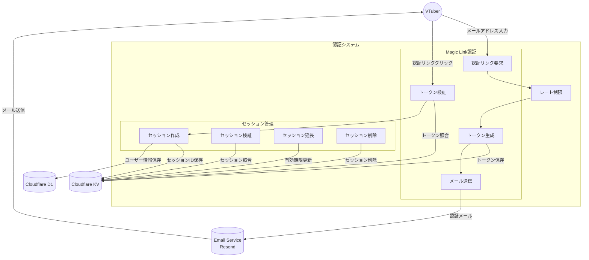
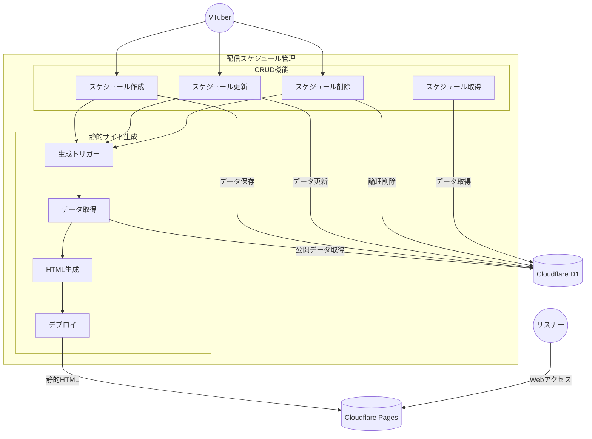
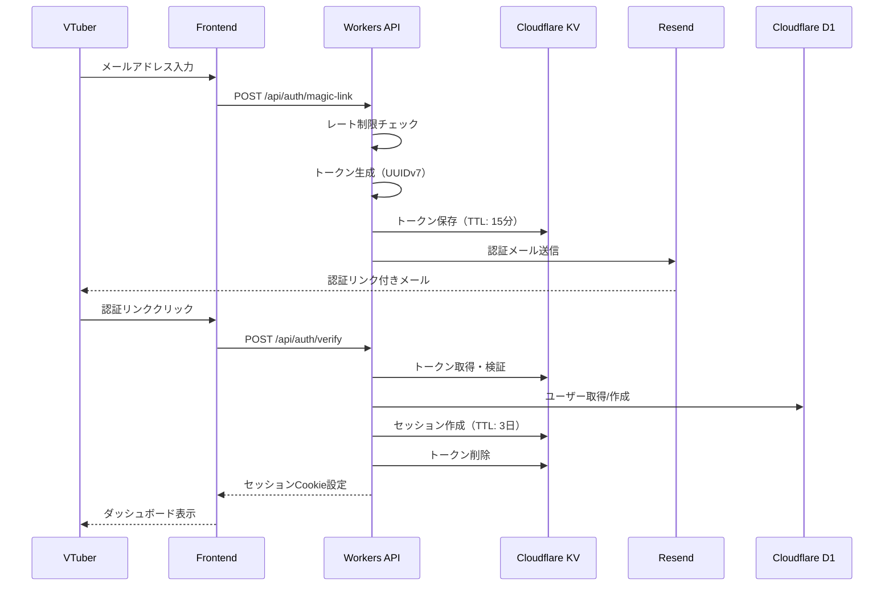
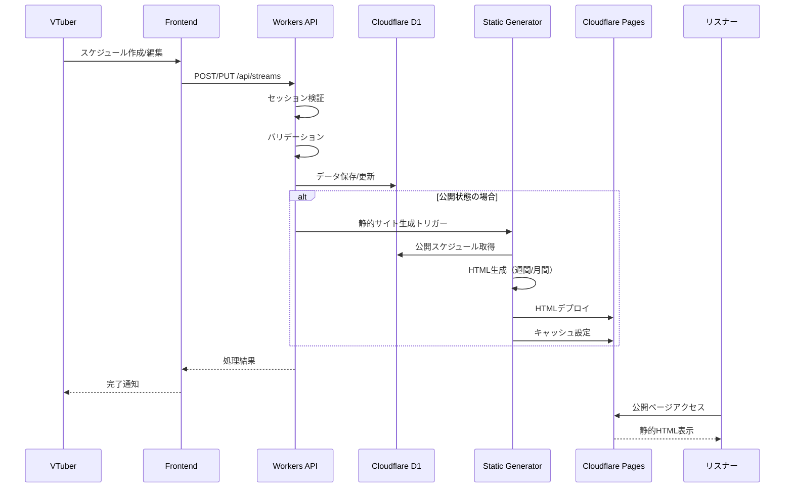

# VTuneHub Phase 1 機能仕様書

## 1. 概要

本ドキュメントでは、VTuneHub Phase 1（MVP）システムの各機能について技術的な詳細仕様を定義します。要求仕様書で定義された要件を基に、各機能が提供すべき価値と振る舞いを記述します。

## 2. システム概要図

### 2.1 認証システム


### 2.2 配信スケジュール管理システム


## 3. 機能詳細仕様


#### 3.1 認証システム


#### 3.2 配信スケジュール管理

##### F005: スケジュール作成
- 優先度: 必須
- 説明: 新規配信予定の作成機能
- 詳細:
  - タイトル入力（必須、最大100文字）
  - タグ入力(必須)
  - 日時選択（必須、現在時刻以降、現在日から3か月先未満）
  - 配信プラットフォーム選択（YouTube/Twitch/ニコニコ）
  - 配信タイプ選択（雑談/ゲーム/歌枠/コラボ）
  - 説明文入力（任意、最大500文字）
  - 公開/非公開の設定

##### F006: スケジュール一覧表示
- 優先度: 必須
- 説明: 登録済みスケジュールの一覧表示
- 詳細:
  - カード形式での表示
  - 時系列順（直近が上）
  - ページネーション（20件/ページ）
  - 配信タイプ別の色分け
  - 公開/非公開の視覚的区別

##### F007: スケジュール編集
- 優先度: 必須
- 説明: 既存スケジュールの編集機能
- 詳細:
  - 全項目の編集可能
  - 変更履歴の保持（最終更新日時）
  - 編集中の自動保存（下書き機能）

##### F008: スケジュール削除
- 優先度: 必須
- 説明: スケジュールの削除機能
- 詳細:
  - 削除確認ダイアログ
  - ソフトデリート（論理削除）
  - 削除後30日間は復元可能

##### F009: リスナー閲覧用の静的サイト書き出し
- 優先度: 必須
- 説明: スケジュールがhtmlファイル内に書き込まれた静的サイトをデプロイ
- 詳細:
  - 生成内容
    - /public/{user_id}/index.html
    - 必要なCSS/JSファイル
  - 生成トリガー条件：
    - スケジュール新規作成（state: 2）
    - state変更（0,1 → 2、2 → 0,1,3）
    - 公開スケジュールの内容編集
    - 公開スケジュールの削除（論理削除）
  - 複数の更新が同時に発生した場合、最後の更新のみ反映させる
  - cloudflareのcache設定
  　　- Cache-Control: public, max-age=300  # 5分
  - 静的サイト生成失敗時、管理画面に通知(internal error)
    - リトライなし、古いバージョンを保持


#### 3.3 公開ページ

##### F011: 公開スケジュール表示
- 優先度: 必須
- 説明: リスナー向けの配信予定公開ページ
- 詳細:
  - 認証不要でアクセス可能
    - 完全静的サイトとしてデプロイ
  - 公開設定のスケジュールのみ表示
  - 今日を含む1週間分の予定表示（日曜開始）
    - 週番号定義：日曜始まり、1月1日を含む週が第1週
    - 注：ISO 8601とは異なる独自仕様
  - モバイルレスポンシブ対応
  - OGP対応（SNSシェア用）

##### F012: カレンダービュー（簡易版）
- 優先度: 低
- 説明: 週間カレンダー形式での表示
- 詳細:
  - 当週のカレンダー表示（日曜開始）
  - 配信予定日にマーカー表示
  - 日付クリックで詳細表示


### 3.1 認証システム

#### 3.1.1 Magic Link認証機能

**機能ID**: F001  
**対応機能要件**: FR-1, FR-3  
**対応ユーザーストーリー**:  

**概要**: 
パスワードを使わずにメールアドレスだけでログインできる仕組みを提供します。VTuberはパスワードを覚える必要がなく、メールを受信できる環境があれば安全にログインできます。

**提供する機能**:
- **メールアドレス入力ページ表示**: VTuberがログインするために使う。メールアドレス入力欄とsubmit。
- **認証リンク要求**: VTuberがメールアドレスを入力すると、そのアドレスに一時的な認証リンクを送信する
- **トークン管理**: 15分間有効な一意の認証トークン(UUIDv7)を生成し、KVストアに管理する
- **メール送信**: Resend APIを通じて、認証リンクを含むHTMLメールを送信する
- **トークン検証**: 認証リンクがクリックされた際に、トークンの有効性を確認してユーザーを認証する
- **トークン削除**: ユーザー認証が終わったトークンはKVストアから削除する

**トークン有効性**:
- KVストアの認証トークンストアに当該トークンが存在すること
  - Keyがトークンの値(UUIDv7)そのものになっている
  - expirationTtlの設定により、当該トークンが存在=expires_at以内であることが確定する
    - Valueに記載された有効期間(created_at, expores_at)は現状は参考情報

**認証トークンデータ構造**:
```typescript
// key: auth:{auth_token}
interface AuthToken {
  user_email: string;
  created_at: Date;
  expires_at: Date;
};
```

**expirationTtl設定例**
```typescript
// 15分 = 900秒
await KV_NAMESPACE.put(sessionId, JSON.stringify(sessionData), {
  expirationTtl: 900
});
```

**セキュリティ考慮事項**:
- トークンは推測不可能なUUIDv7形式を使用
- 使用済みトークンは即座に無効化
- 有効期限切れトークンは自動的に無効(Cloudflare KVのexpireationTtl設定により実現)

**エラー処理**:
- メール送信失敗時は内部エラーとして記録
- 無効なトークンもしくは期限切れの場合は適切なエラーメッセージを表示
  - 両方とも、KVストアにトークンが存在しないになっているはず

---

#### 3.1.2 セッション管理機能

**機能ID**: F002
**対応機能要件**: FR-1
**対応ユーザーストーリー**: 

**概要**:
一度ログインしたVTuberが、3日間は再ログインなしでシステムを利用できるようにします。

**提供する機能**:
- **セッション作成**: 認証成功時に3日間有効なセッションID(UUIDv7)を作成
- **セッション保存**: httpOnly Cookie
- **セッション検証**: APIアクセス時にセッションの有効性を確認
- **自動延長**: アクティブなユーザーのセッションを自動的に延長（残り1日未満で3日間延長）
- **ログアウト**: 明示的なログアウト機能

**セッションデータ構造**:
```typescript
// key: session:{session_id}
interface SessionData {
  user_id: string;
  created_at: Date;
  expires_at: Date;
}
```

**セッション有効性**:
- KVストアにセッションIDが存在すること
- 現在時刻が、expires_at以前であること
  - expirationTtlに3日を指定しておくので、実際にはexpires_atのチェックは不要
  - expires_atは、セッションの延長のために使う

**セッション自動延長**:
- 新しいSession IDを発行し、expirationTtlを設定の上KVストアに格納する
- 古いSession IDはKVストアから即時削除する

**Cookie仕様**:
- httpOnly: JavaScriptからのアクセスを防止
- secure: HTTPS通信でのみ送信
- sameSite: Lax（CSRF攻撃対策）
- 有効期間: 3日間

---

### 3.2 配信スケジュール管理システム

**機能ID**: F003  
**対応機能要件**: FR-5, FR-6, FR-7, FR-8  
**対応ユーザーストーリー**:  

**概要**:
VTuberが配信予定を管理し、リスナーに公開するための中核機能です。

#### 3.2.1 データモデル

**Streamデータ構造**:
```typescript
interface Stream {
  stream_id: string;        // UUIDv7形式の一意識別子
  user_id: string;          // UUIDv4形式のユーザー識別子
  title: string;            // 配信タイトル（最大100文字）
  scheduled_at: Date;       // 配信予定日時
  platform: 'youtube' | 'twitch' | 'niconico';
  stream_type: 'chat' | 'game' | 'singing' | 'collab';
  description?: string;     // 配信説明（最大500文字）
  thumbnail_url?: string;   // サムネイルURL
  tags: string[];          // タグ配列（各最大50文字）
  state: number;           // 0:未公開未確定 1:未公開確定 2:公開 3:終了
  created_at: Date;
  updated_at: Date;
  deleted_at: Date | null;
}
```

#### 3.2.2 スケジュール管理機能

**作成機能**:
- 配信予定を新規登録する
- 最大3ヶ月先まで予約可能
- 公開/非公開の選択が可能
- タグによる分類をサポート

**一覧表示機能**:
- 今後の配信予定を時系列で表示
- ページネーション対応（20件/ページ）
- 週単位での取得も可能（カレンダー表示用）
- 配信タイプごとに色分け表示

**編集機能**:
- 登録済みスケジュールの全項目を変更可能
- 公開状態の切り替えが可能
- 変更履歴を自動記録

**削除機能**:
- 論理削除により30日間は復元可能
- 物理削除は30日後に自動実行

**週単位取得の仕様**:
- 日曜始まりの週番号で指定
- 1月1日を含む週が第1週
- 月間表示では当月を含む4-5週分を取得

**バリデーションルール**
- zodによりtypescriptの型からバリデーションを行う
  - tag: 最大50文字の文字列
  - title: 最大100文字の文字列
  - description: 最大500文字の文字列

---

### 3.3 静的サイト生成システム

**機能ID**: F004  
**対応機能要件**: FR-9, FR-11  
**対応ユーザーストーリー**:  

**概要**:
リスナー向けの配信スケジュールページを静的HTMLとして生成し、高速かつ安定したアクセスを提供します。

#### 3.3.1 生成トリガー

**自動生成が発生するタイミング**:
- 公開状態のスケジュールが作成された時
- スケジュールが公開/非公開に切り替わった時
- 公開スケジュールの内容が更新された時
- 公開スケジュールが削除された時

**生成制御**:
- 同一ユーザーの連続更新では最後の更新のみを反映
- 生成中の排他制御により重複実行を防止

#### 3.3.2 生成内容

**週間ビュー**:
- 今週（日曜〜土曜）の配信予定を表示
- 各日付に配信カードを配置
- レスポンシブデザイン対応

**月間ビュー**:
- 当月を含む4-5週分の配信予定を表示
- 月初を含む週の日曜から月末を含む週の土曜まで
- 週間ビューと同様のレイアウト

**ファイル構成**:
- `/public/{user_id}/index.html` - デフォルトページ（週間ビューと同じ）
- `/public/{user_id}/week.html` - 週間ビュー
- `/public/{user_id}/month.html` - 月間ビュー

**キャッシュ設定**:
- Cache-Control: public, max-age=300（5分間キャッシュ）

---

#### 3.4 レート制限機能

**機能ID**: F005
**対応機能要件**: FR-2, FR-5

**概要**:
第三者からの攻撃や過負荷によるサービス不能リスクを減らすため、Vtuberのemailとアクセス元IPアドレス、Session IDを用いて、認証及びAPIリクエストの回数を制限します。

**提供する機能**:
- **レート制限項目抽出1**: F001の認証リンク要求を処理する前に、Vtuberが入力してsubmitしたemailアドレスと、その送信元IPアドレスを抽出する
- **レート制限項目抽出2**: APIリクエストを処理する前に、Session IDを抽出する
- **レート記録**: KVストアからレート制限項目のValueを読み出し、アクセス時間をValueに追記
- **レート制限チェック**: 後述のレート制限をチェックし、F001の認証リンク要求処理を継続する

**レート制限データ構造**:
```typescript
// Key: rate:auth:email:{email}
// Key: rate:auth:ip:{ip}
// Key: rate:api:session:{session_id}
interface RateLimit {
  requested_at: Date[];
}
```

**制限方式**:
- スライディングウィンドウ方式で計測
- 制限超過時は429エラーを返却
- レート制限時は、リセット時刻を通知して再試行を促すページを表示する

**レート制限値**:
- **emailアドレス**: 同一emailアドレスからの認証リンク要求は、直近1時間で5回までに制限する
- **IPアドレス**: 同一IPアドレスからの認証リンク要求は、直近1時間で10回までに制限する
- **Session ID**: 同一Session IDからのAPIリクエストは、直近1時間で1000回までに制限する

**エラー処理**:
- emailアドレス、IPアドレス、Session IDによるレート制限であることと、解除される時間をユーザーに通知する（エラーページを表示する）

---


## 4. データモデル

### 4.1 データベーススキーマ（D1）

テーブル構成は参考です。

#### users テーブル
```sql
CREATE TABLE users (
  user_id TEXT PRIMARY KEY,
  email TEXT UNIQUE NOT NULL,
  name TEXT,
  created_at INTEGER NOT NULL,
  updated_at INTEGER NOT NULL,
  deleted_at INTEGER
);
CREATE INDEX idx_users_email ON users(email);
```

user_idはUUIDv4を想定。そのまま各人のURLにパスとして含まれる。

#### streams テーブル
```sql
CREATE TABLE streams (
  stream_id TEXT PRIMARY KEY,
  user_id TEXT NOT NULL,
  title TEXT NOT NULL,
  scheduled_at INTEGER NOT NULL,
  platform TEXT NOT NULL,
  stream_type TEXT NOT NULL,
  description TEXT,
  thumbnail_url TEXT,
  tags JSON,
  state INTEGER NOT NULL DEFAULT 0,
  created_at INTEGER NOT NULL,
  updated_at INTEGER NOT NULL,
  deleted_at INTEGER
);
CREATE INDEX idx_streams_user_id ON streams(user_id);
CREATE INDEX idx_streams_scheduled_at ON streams(scheduled_at);
```
stream_idはUUIDv7を想定

### 4.2 KVストレージ構造

#### 認証トークン
```typescript
// key: auth:{auth_token}
interface AuthToken {
  user_email: string;
  created_at: Date;
  used_at: Date | null;
  expires_at: Date;
};
```

#### セッション
```typescript
// Key: session:{session_id}
interface SessionData {
  user_id: string;
  email: string;
  created_at: Date;
  expires_at: Date;
}
```

#### レート制限
```typescript
// 認証 10回/時
// Key: rate:auth:email:{email}

// API 1000回/時
// Key: rate:api:session:{session_id}

interface RateLimit {
  count: number;
  reset_at: number;
}
```

### 4.3 typescript型宣言

型宣言は参考です。

```typescript
interface Stream {
  info: PublicStream;
  state: number;
  created_at: Date;
  updated_at: Date;
  deleted_at: Date | null;
}

interface PublicStream {
  stream_id: string;
  user_id: string;
  title: string;
  scheduled_at: Date;
  platform: 'youtube' | 'twitch' | 'niconico';
  stream_type: 'chat' | 'game' | 'singing' | 'collab';
  description: string;
  thumbnail_url: string;
  tags: string[];
}
```


### 5.2 APIインターフェース

#### 5.2.1 認証API

##### API-1: Magic Link送信
```
POST /api/auth/magic-link
Request: { email: string }
Response: { status: number, message?: string }

status:
  -1: internal error(messageに詳細を記載、emailサーバーが正しく応答しない、もこれ)
  0: success (email sent)
  1: rate limit over (too meny login request)
```

##### API-2: 認証確認
```
POST /api/auth/verify
Request: { auth_token: string }
Response: { status: number, message?: string }

status:
  -1: internal error(messageに詳細を記載)
  0: success (auth successfuly)
  1: rate limit over (too meny login request)
  2: expireed. (auth_token)
  3: auth_token/session_id does not match
```

session idはクッキーとしてサーバーからクライアントに送信されます。

##### API-3: ログアウト
```
POST /api/auth/logout
Response: { status: number, message?: string }

status:
  -1: internal error(messageに詳細を記載)
  0: success (logout successfuly)
  1: rate limit over (too meny API request)
  2: expireed (session_id)
  3: auth_token/session_id does not match
```

#### 5.2.2 スケジュールAPI

##### API-4: スケジュール作成
```
POST /api/streams
Request: Stream object(without stream_id)
Response: { status: number, message?: string, stream: Stream }

status:
  -1: internal error(messageに詳細を記載)
  0: success (create schedule successfuly)
  1: rate limit over (too meny API request)
  2: expireed (session_id)
  3: auth_token/session_id does not match
```

##### API-5: スケジュール取得
```
GET /api/streams?page=1&limit=20
Response: { status: number, message?: string, streams: Stream[], last_page: number }

pageは1オリジン。今の日時の30分前からはじめて、未来に向かってリストアップする。配信中も含む。過去のスケジュールはこの項目では表示できない。

status:
  -1: internal error(messageに詳細を記載)
  0: success (read schedule successfuly)
  1: rate limit over (too meny API request)
  2: expireed (session_id)
  3: auth_token/session_id does not match
  4: malformed parameters (there are no required fields or too meny fields)
  6: out_of_range(page and limit is too big)
```

```
GET /api/streams?year=2025&week=1
Response: { status: number, message?: string, streams: Stream[] }

weekは今年の何週目かを与える。1オリジン。日曜始まり、1月1日を含む週が第1週
注：ISO 8601とは異なる独自仕様
1か月のデータはweekを4~5回呼んで取得
1か月の定義は、当日を含む月で、週の途中で月が替わる場合は、前月の最後の週/後月の最初の週を含む、4~5週と定める。

status:
  -1: internal error(messageに詳細を記載)
  0: success (read schedule successfuly)
  1: rate limit over (too meny API request)
  2: expireed (session_id)
  3: auth_token/session_id does not match
  4: malformed parameters (there are no required fields or too meny fields)
  6: out_of_range(year and week is out of range)
```

```
GET /api/streams/:id
Response: { status: number, message?: string, stream: Stream }

status:
  -1: internal error(messageに詳細を記載)
  0: success (read schedule successfuly)
  1: rate limit over (too meny API request)
  2: expireed (session_id)
  3: auth_token/session_id does not match
  4: malformed parameters (there are no required fields or too meny fields)
  5: id does not found(stream_id)
```

##### API-6: スケジュール更新
```
PUT /api/streams/:id
Request: Stream object
Response: { status: number, message?: string }

status:
  -1: internal error(messageに詳細を記載)
  0: success (update schedule successfuly)
  1: rate limit over (too meny API request)
  2: expireed (session_id)
  3: auth_token/session_id does not match
  4: malformed parameters (there are no required fields or too meny fields)
  5: id does not found(stream_id)
```

##### API-7: スケジュール削除
```
DELETE /api/streams/:id
Response: { status: number, message?: string }

status:
  -1: internal error(messageに詳細を記載)
  0: success (delete schedule successfuly)
  1: rate limit over (too meny API request)
  2: expireed (session_id)
  3: auth_token/session_id does not match
  4: malformed parameters (there are no required fields or too meny fields)
  5: id does not found(stream_id)
```


## 4. APIインターフェース詳細

### 4.1 認証API

#### API-1: Magic Link送信
- **エンドポイント**: POST /api/auth/magic-link
- **目的**: メールアドレスに認証リンクを送信
- **入力**: メールアドレス
- **処理**: メール形式検証、レート制限確認、トークン生成、メール送信
- **出力**: status（0:成功, 1:レート制限, 4:形式エラー, -1:内部エラー）

#### API-2: 認証確認
- **エンドポイント**: POST /api/auth/verify
- **目的**: 認証トークンを検証してセッションを作成
- **入力**: 認証トークン
- **処理**: トークン検証、ユーザー取得/作成、セッション作成
- **出力**: status（0:成功, 2:期限切れ, 3:無効トークン, -1:内部エラー）
- **副作用**: セッションIDをCookieに設定

#### API-3: ログアウト
- **エンドポイント**: POST /api/auth/logout
- **目的**: セッションを終了
- **処理**: セッション削除、Cookie無効化
- **出力**: status（0:成功, -1:内部エラー）

### 4.2 スケジュールAPI

#### API-4: スケジュール作成
- **エンドポイント**: POST /api/streams
- **目的**: 新規配信予定を登録
- **入力**: Stream情報（stream_id除く）
- **処理**: セッション検証、入力検証、DB保存、静的サイト生成（公開時）
- **出力**: status、作成されたStream

#### API-5: スケジュール取得
- **エンドポイント**: GET /api/streams
- **目的**: 配信予定一覧を取得
- **パラメータ種別**:
  - ページネーション: ?page=1&limit=20
  - 週単位: ?year=2025&week=1
- **処理**: セッション検証、期間計算、データ取得
- **出力**: status、streams配列、メタ情報

#### API-6: スケジュール更新
- **エンドポイント**: PUT /api/streams/:id
- **目的**: 既存スケジュールを変更
- **入力**: 更新するStream情報
- **処理**: セッション検証、権限確認、DB更新、静的サイト生成（必要時）
- **出力**: status

#### API-7: スケジュール削除
- **エンドポイント**: DELETE /api/streams/:id
- **目的**: スケジュールを論理削除
- **処理**: セッション検証、権限確認、論理削除、静的サイト生成（公開時）
- **出力**: status

---

## 5. データフロー詳細

### 5.1 認証フロー



### 5.2 スケジュール更新フロー



---

## 6. エラーハンドリング

### 6.1 エラー分類と対応

| エラータイプ | HTTPステータス | status値 | ユーザーメッセージ | 対応アクション |
|------------|--------------|---------|------------------|--------------|
| 内部エラー | 500 | -1 | 「システムエラーが発生しました」 | ログ記録、既存状態維持 |
| 成功 | 200 | 0 | - | - |
| レート制限超過 | 429 | 1 | 「リクエストが多すぎます」 | 待機時間表示 |
| セッション期限切れ | 401 | 2 | 「ログインが必要です」 | 再ログイン画面へ |
| 認証エラー | 401 | 3 | 「認証に失敗しました」 | 再試行案内 |
| パラメータエラー | 400 | 4 | 「入力内容に誤りがあります」 | エラー箇所表示 |
| リソース未検出 | 404 | 5 | 「データが見つかりません」 | 一覧へ戻る |
| 範囲外エラー | 400 | 6 | 「指定範囲が無効です」 | 有効範囲表示 |

### 6.2 エラーログ管理

**記録する情報**:
- エラー発生日時
- エラー種別とメッセージ
- 影響を受けたユーザー
- リクエストの識別情報

**ログの活用**:
- 運用改善のための分析
- 障害発生時の原因調査
- パフォーマンス問題の特定

---

## 7. バリデーション仕様

### 7.1 入力値検証

**メールアドレス**:
- RFC5322準拠の形式
- 最大254文字
- 大文字小文字を区別しない

**UUID**:
- user_id: UUIDv4形式
- session_id, auth_token, stream_id: UUIDv7形式

**スケジュールデータ**:
- タイトル: 必須、1-100文字
- 日時: 現在〜3ヶ月先
- プラットフォーム: 定義された値のみ
- 配信タイプ: 定義された値のみ
- 説明: 任意、最大500文字
- タグ: 各50文字以内の文字列配列

**バリデーションエラー時の動作**:
- 具体的なエラー内容を返却
- 該当フィールドを特定可能にする
- 再入力を促すメッセージ表示

---

## 8. セキュリティ仕様

### 8.1 認証・認可

**多層防御の実装**:
- Magic Link: パスワード不要で安全な認証
- セッション管理: 3日間の有効期限で利便性と安全性のバランス
- Cookie保護: httpOnly、secure、sameSite設定
- レート制限: ブルートフォース攻撃の防止

### 8.2 データ保護

**SQLインジェクション対策**:
- プリペアドステートメントの使用を徹底
- ユーザー入力を直接SQLに組み込まない

**XSS対策**:
- Reactの自動エスケープを活用
- CSPヘッダーでスクリプト実行を制限

**CSRF対策**:
- sameSite Cookieの使用
- stateパラメータによる検証（将来実装）

---

## 9. パフォーマンス要件

### 9.1 応答時間目標

| 操作 | 目標時間 | 最大許容時間 | 測定ポイント |
|------|---------|------------|----------|
| 初回ページロード | 1.5秒 | 2秒 | DOMContentLoaded |
| API応答（認証） | 150ms | 200ms | サーバー処理時間 |
| API応答（CRUD） | 100ms | 200ms | サーバー処理時間 |
| 静的サイト生成 | 1秒 | 3秒 | 全体処理時間 |
| セッション検証 | 50ms | 100ms | KV取得時間 |

### 9.2 容量制限

| 項目 | 制限値 | 対応方針 |
|------|--------|---------|
| リクエストボディ | 100KB | 大きなデータは分割送信 |
| レスポンスボディ | 10MB | ページネーションで対応 |
| KVストレージ値 | 25MB | 1レコードあたりの上限 |
| D1データベース | 10GB | 定期的な古データ削除 |

---

## 10. 非同期処理設計

### 10.1 静的サイト生成

**非同期実行の目的**:
- APIレスポンスの高速化
- ユーザー体験の向上
- システム負荷の分散

**実装方針**:
- Workers の waitUntil を使用して非同期実行
- 生成中フラグで重複実行を防止
- 失敗時は既存ファイルを保持

### 10.2 定期処理

**KVストア整理**:
- Cron Triggersで毎日午前3時（UTC）に実行
- 30日経過した論理削除データを物理削除
- TTL設定により自動削除されるため最小限の処理

---

## 11. テスト仕様

### 11.1 単体テスト対象

**バリデーション関数**:
- メールアドレス形式の検証
- UUID形式の検証
- 日付範囲の検証
- 文字数制限の検証

**ビジネスロジック**:
- レート制限の計算
- セッション有効期限の判定
- 静的サイト生成トリガーの判定

### 11.2 統合テスト対象

**認証フロー**:
- Magic Link要求から認証完了まで
- セッション作成と検証
- ログアウト処理

**スケジュール管理フロー**:
- CRUD操作の一連の流れ
- 静的サイト生成の連携
- 権限チェックの動作

---

## 12. 運用・監視

### 12.1 監視項目

| 項目 | 閾値 | アラート条件 | 対応 |
|------|------|------------|------|
| API応答時間 | 500ms | p95 > 500ms | パフォーマンス調査 |
| エラー率 | 1% | 5分間で1%超過 | エラー内容確認 |
| Workers使用量 | 90,000/日 | 90%到達 | 使用量削減検討 |
| D1容量 | 8GB | 80%到達 | データ整理実施 |

### 12.2 ログ管理

**記録内容**:
- APIアクセスログ
- エラーログ
- パフォーマンスメトリクス
- セキュリティイベント

**活用方法**:
- 日次でエラー率を確認
- 週次でパフォーマンス傾向を分析
- 月次で利用統計をレポート

---

## 13. 将来の拡張性

### 13.1 Phase 2への準備

**拡張予定の機能**:
- 配信準備チェックリスト
- 楽曲管理機能
- マシュマロ連携
- 定期配信設定

**設計上の考慮**:
- データモデルに拡張用フィールドを予約
- APIバージョニングの準備
- プラグイン機構の基盤整備

### 13.2 スケーラビリティ

**水平スケーリング**:
- Cloudflare Workersの自動スケーリングを活用
- 静的サイト生成で動的処理を削減

**垂直スケーリング**:
- 必要に応じて有料プランへ移行
- キャッシュ戦略の最適化

---

**Document Version**: 1.0.0  
**Phase**: 01 (MVP)  
**Last Updated**: 2024-12-XX  
**Author**: VTuneHub Development Team  
**Status**: Draft