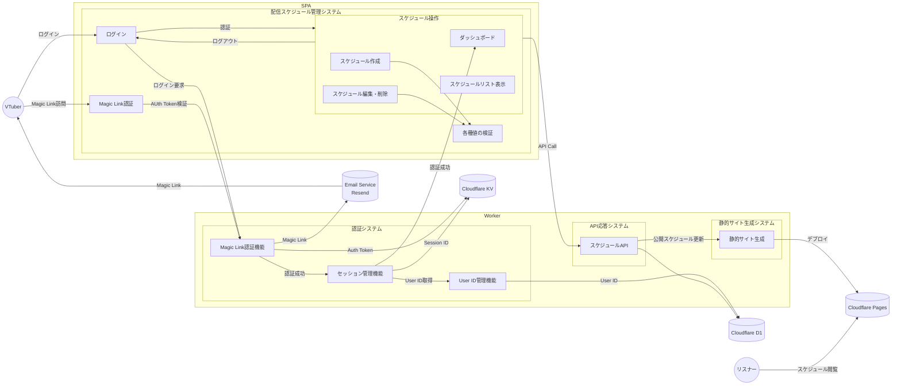
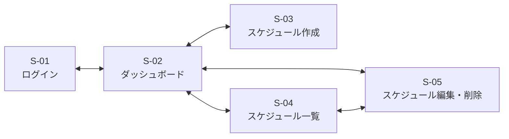
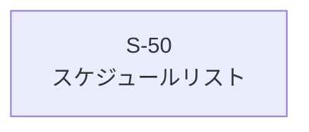
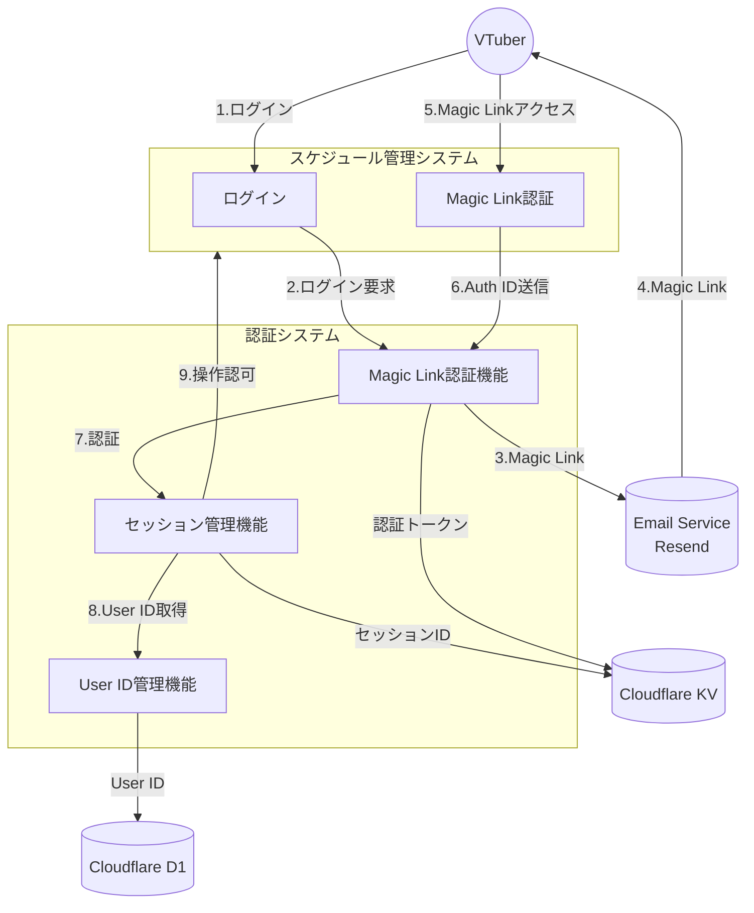

# VTuneHub Phase 1 機能仕様書

## 1. 概要

本ドキュメントでは、VTuneHub Phase 1（MVP）システムの各機能について技術的な詳細仕様を定義します。要求仕様書で定義された要件を基に、各機能が提供すべき振る舞いを記述します。

VTuneHub Phase 1 (MVP)は、VTuberが自身のスケジュールを管理し、それをリスナーに公開することを主要機能とします。VTuberはemailベースのMagic Linkを用いた認証により認可を受け、スケジュールを管理します。スケジュールは静的サイト経由でユーザーに公開されます。VTuberが公開スケジュールを作成修正するたびに、静的サイトをCloudflare Pagesにデプロイし、スケジュールをユーザーに公開します。

VtuneHubは、Cloudflareの各サービスを用いたSPAとして実装されます。SPAはReact Routerを用いて実装され、APIはCloudflare Workers + Honoで実現されます。トークンやセッションID類はKVに格納され、スケジュールはD1に格納されます。

VtuneHubは認証システム・配信スケジュール管理システム・静的サイト生成システムの3種類のシステムからなります。このうち、SPAで画面が存在するのは認証システムと配信スケジュール管理システムです。これらのシステムは、ブラウザ上に画面をレンダリングし、ユーザーの操作に従いWorkers + Honoによって提供されるAPI越しに操作を行い、改めて編集取得されたデータを画面にレンダリングします。静的サイト生成システムは、静的サイト生成用のAPIをユーザー操作の裏で呼び出すことで、Workers上でのみ動作します。


## 2. アーキテクチャ

### 2.1 システムブロック図


## 2.2 画面遷移図

### 2.2.1 VTuneHub (VTuber用画面)


### 2.2.2 リスナー用画面


## 3. 機能仕様

### 3.1 認証システム

VTuneHubの認証はMagic Linkを使います。認証手順を以下に示します。

1. Vtuberがログイン画面にアクセスする。フォームに自分のメールアドレスを入力してSubmitを押下する
2. VTuneHubのSPAは、ログインAPIを呼び出す
3. ログインAPIはAuth Tokenを生成して、それをMagic Linkに埋め込み、外部email送信サービスに送る。Auth Tokenとそれに結び付いたemailアドレスはKVストアにも格納される
4. 外部email送信サービスは、Magic Linkの書かれたメールをVTuberに送付する
5. Vtuberは、届いたメールに書いてあるMagic Linkをクリックして訪問する。
6. 訪問したMagic Link認証ページでは、Magic Link内に記載されてあるAuth TokenをAuth Token検証APIのパラメータとして渡す
7. KVストアにAuth Tokenが存在することを確認する。存在した場合は認証される。ユーザーはemailアドレスにより指定される。
8. emailにより指定されたユーザーのIDをD1から取得する。D1に登録がなければ、ユーザーIDをあたらに生成してemailアドレスとともにD1に格納する。
9. Session IDを生成し、User IDとともにKVストアに格納する。同時に同じものをhttpOnly Cookieとしてブラウザに渡す。Session IDがAPIリクエストとともに提供される限り、APIへのアクセスの認可を出し続ける。




#### 3.1.1 Magic Link認証機能

**機能ID**: F-01-001  
**対応機能要件**: FR-1, FR-3  
**対応ユーザーストーリー**:  
**対応画面**: なし

**概要**: 
パスワードを使わずにメールアドレスだけでログインできる仕組みを提供します。VTuberはパスワードを覚える必要がなく、メールを受信できる環境があれば安全にログインできます。

**提供する機能**:
- **認証リンク要求**: VTuberが入力したメールアドレスに一時的な認証リンクを送信します。
- **トークン管理**: 15分間有効な一意の認証トークン(UUIDv7)を生成し、KVストアで管理します。
- **トークン検証**: 認証リンクがクリックされた際に、トークンの有効性を確認してユーザーを認証します。
- **トークン削除**: ユーザー認証が終わったトークンはKVストアから削除します。

**認証トークンデータ構造**:
```typescript
// key: auth:{auth_token}
interface AuthToken {
  user_email: string;
  created_at: Date;
  expires_at: Date;
};
```

**トークン有効性**:
- KVストアの認証トークンストアに当該トークンが存在すること
  - Keyがトークンの値(UUIDv7)そのものになっています
  - expirationTtlの設定により、当該トークンが存在 = expires_at以内であることが確定
    - Valueに記載された有効期間(created_at, expores_at)は現状は参考情報で、トークンの検証には使われません

**expirationTtl設定例**
```typescript
// 15分 = 900秒
await KV_NAMESPACE.put(sessionId, JSON.stringify(sessionData), {
  expirationTtl: 900
});
```

**セキュリティ考慮事項**:
- トークンは推測不可能なUUIDv7形式
- 使用済みトークンは即座に無効化
- 有効期限切れトークンは自動的に無効化
  - Cloudflare KVのexpireationTtl設定により、KVストアからエントリ自体を削除することで実現

**エラー処理**:
- メール送信失敗時は内部エラーとして記録
- 無効なトークンもしくは期限切れの場合は適切なエラーメッセージを表示
  - 両方の場合とも、KVストアにトークンが存在しない

---

#### 3.1.2 セッション管理機能

**機能ID**: F-01-002
**対応機能要件**: FR-1
**対応ユーザーストーリー**: 
**対応画面**: なし  

**概要**:
一度ログインしたVTuberが、3日間は再ログインなしでシステムを利用できるようにします。

**提供する機能**:
- **セッション作成**: 認証成功時に3日間有効なセッションID(UUIDv7)を作成します。
- **セッション保存**: httpOnly Cookieにセッションを保存します。
- **セッション検証**: APIアクセス時にセッションの有効性を確認します。
- **自動延長**: アクティブなユーザーのセッションを自動的に延長します。
  - 残り1日未満で3日間延長します。
- **ログアウト**: 明示的なログアウトボタンを持ち、セッションの有効期限に関わらず即座にセッションIDを破棄してログアウトします。

**セッションデータ構造**:
```typescript
// key: session:{session_id}
interface SessionData {
  user_id: string;
  created_at: Date;
  expires_at: Date;
}
```

**セッション有効性**:
- KVストアにセッションIDが存在すること
- 現在時刻が、expires_at以前であること
  - expirationTtlに3日を指定しておくので、実際にはexpires_atのチェックは不要です
  - expires_atは、セッションの延長のために使います

**セッション自動延長**:
- 新しいSession IDを発行し、expirationTtlを設定の上KVストアに格納
- 古いSession IDはKVストアから即時削除

**Cookie仕様**:
- httpOnly: JavaScriptからのアクセスを防止
- secure: HTTPS通信でのみ送信
- sameSite: Lax（CSRF攻撃対策）
- 有効期間: 3日間

---

---

#### 3.1.3 ユーザー管理機能

**機能ID**: F-01-003
**対応機能要件**: FR-1
**対応ユーザーストーリー**: 
**対応画面**: なし  

**概要**:
Magic Linkを送信した先のemailアドレスとUser IDを結びつけてD1で永続化します。User IDが存在しない場合は新たに作成します。

**提供する機能**:
- **ユーザー作成**: emailアドレスに対応すUser IDを新規に生成し、ユーザーを作成します。作成したユーザーのデータはD1で永続化します。
- **ユーザーID確認**: emailアドレスに対応するUser IDが存在するかを確認し、存在した場合はUserのデータを返します。UserのデータにはUserIDが含まれます。
- **ユーザー削除機能**: User IDで指定されるユーザーデータを削除します。論理削除です。deleted_atに削除日時を設定することで論理削除を行います。
- **ユーザー完全削除機能**: deleted_atから30日が経過した場合、ユーザーデータをD1のテーブルから削除し、同時に、ユーザーIDに結び付いたスケジュールもすべて削除します。これは論理削除ではありません。

**ユーザーデータ構造**:
```typescript
interface UserData {
  user_id: string;
  email: string;
  created_at: Date;
  deleted_at: Date | null;
}
```

---

### 3.2 配信スケジュール管理システム

VTuberが配信予定を管理し、リスナーに公開するための中核システムです。React Routerを用いたSPAとして実装され、静的ファイル（index.html, .js, .css等）のホスティングはCloudflare Pagesで行います。APIはCloudflare Workers + Honoにより実現します。

#### 3.2.1 データモデル

**Streamデータ構造**:
```typescript
interface Stream {
  stream_id: string;  // UUIDv7
  info: StreamInfo;
  state: number;
  created_at: number; // Date
  updated_at: number; // Date
  deleted_at: number | null;  // Date
}

interface PublicStream {
  stream_id: string;
  info: StreamInfo;
}

interface StreamOnCreate {
  info: StreamInfo;
  state: number;
}

interface StreamInfo {
  user_id: string;
  title: string;
  will_start_at: number;  // Date
  will_end_at: number;  // Date
  platform: 'youtube' | 'twitch' | 'niconico';
  stream_type: 'chat' | 'game' | 'singing' | 'collab';
  description: string;
  tags: string[];
}
```

#### 3.2.2 Stream state状態遷移

- 公開/未公開などの状態の設定
  - 0: 未公開・未確定
  - 1: 未公開・確定
  - 2: 公開


#### 3.2.3 ダッシュボード機能

**機能ID**: F-02-001
**対応機能要件**: 
**対応ユーザーストーリー**:  
**対応画面**: S-01, S-02  

**概要**: ユーザーからのログイン要求を処理します。emailアドレスの入力を促し、そのアドレスにMagic Linkを送信します。Magic Linkをユーザーがクリックすることでログインを行い、ダッシュボードに遷移します。

**提供する機能**:
- **ログイン画面(S-01)表示**: VTuberがログインするために使います。メールアドレスをフォームに入力しsubmitボタンを押下すると、認証リンク要求を行います。
- **認証リンク要求(S-02)**: VTuberが入力したメールアドレスに一時的な認証リンクを送信します。


#### 3.2.4 ダッシュボード機能

**機能ID**: F-02-002
**対応機能要件**: FR-5
**対応ユーザーストーリー**:  
**対応画面**: S-03  

**概要**: ログイン直後のメイン画面としてのダッシュボードを表示します。各種ボタンを押すことにより他の画面に遷移します。

**提供する機能**:
- **ダッシュボード(S-03)表示**: 直近3個のスケジュールをカードのリスト形式で表示します。上が直近で、下が未来です。スケジュールが存在しない場合は、存在しない旨を表示します。
- **スケジュール削除**: カードに存在する削除ボタンを押下された場合は、スケジュールを論理削除しD1に書き込みます。論理削除はdeleted_atフィールドに日付を入力することにより実現します。削除前に警告を出します。
- **ログアウト**: Logoutボタンを押された場合は、セッションをKVストアから削除してログアウトします。ログアウト後はlogin画面に遷移します。

**画面遷移**
- **新規作成ボタンを押下** -> スケジュール作成画面(S-06)
- **スケジュール表示ボタンを押下** -> スケジュールリスト画面(S-04)
- **カードに存在する編集ボタンを押下** -> スケジュール編集・削除画面(S-05)


#### 3.2.5 スケジュール作成機能

**機能ID**: F-02-003  
**対応機能要件**: FR-5  
**対応ユーザーストーリー**:  
**対応画面**: S-06  

**概要**: ユーザーからの入力によりスケジュールを作成する。入力はF007のバリデーション機能により適宜検証される。

**提供する機能**:
- **スケジュール作成画面(S-06)表示**: ユーザーがスケジュールを入力するために使います。StreamOnCreate型に存在する項目をユーザーに入力させます。
- **D1への書き込み**: Submitボタン押下によりAPIを呼び出し、入力されたスケジュールをD1に書き込む。成功/失敗の通知を出します。
- **作成キャンセル**: Cancelボタン押下により、警告を表示し、OKならば入力値を破棄します。
- **編集中の自動保存**: LocalStorageに編集中の値を保持します。Submit or Cancelボタンで値を破棄します。ボタンを押さずにページ遷移した場合でも、編集中の値を復帰できるようにします。
- **編集中ステータス**: 必要な情報が全てそろってバリデーションが通った場合のみ、Submitボタンを有効にします。そうでない場合は無効にし、Submitできないようにします。画面上にも必須項目で未入力の箇所がわかるようにします（手法未定）

**画面遷移**
- **Submitボタンを押下** -> ひとつ前の画面
- **Cancelボタンを押下** -> ひとつ前の画面

**バリデーション**
- フロントエンド・バックエンド共にバリデーションを行う

**エラー処理**
- API呼び出しに失敗した場合、エラー通知を出してスケジュール作成画面に留まる

#### 3.2.6 スケジュール一覧表示機能

**機能ID**: F-02-004
**対応機能要件**: FR-5
**対応ユーザーストーリー**:  
**対応画面**: S-04  

**概要**: ユーザーからリクエストのあった範囲のスケジュールを時系列で表示します。リスト形式、週間カレンダー形式の二種類に対応します。

**提供する機能**:
- **スケジュール取得**: ユーザーから指定のあった範囲のスケジュールをAPIを呼ぶことで取得します。
- **スケジュール一覧(S-04)表示**: 取得したスケジュールをユーザー指定の形式（リストor週間カレンダー）で表示します。
  - リスト形式
    - カード形式のリスト
    - 直近が上、未来が下
    - 直近から5件(今回は固定値)の項目を表示
  - 週間カレンダー形式
    - 縦軸に時間、横軸に日
    - 一番左が日曜
    - 本日を含む日曜はじまりの一週間
  - 配信タイプ別に色分けする(具体値は未定)
  - 公開/非公開の視覚的区別(具体的区別は未定)
  - リスト形式、週間カレンダー形式、共に前と後のページネーションを実装する
- **スケジュール削除**: カードに存在する削除ボタンを押下された場合は、スケジュールを論理削除しD1に書き込みます。論理削除はdeleted_atフィールドに日付を入力することにより実現します。削除前に警告を出します。

**画面遷移**
- **カード上の編集ボタンを押下** -> スケジュール編集画面(S-05)

**エラー処理**
- API呼び出しに失敗した場合、エラー通知を出して現画面に留まります。
- エラー通知は時間で消えるものと、ユーザーが明示的に消すまでとどまるものの二種類があります。種類分けは未検討です。


#### 3.2.7 スケジュール編集・削除機能

**機能ID**: F-02-005
**対応機能要件**: FR-5
**対応ユーザーストーリー**:  
**対応画面**: S-05  

**概要**: ユーザーが指定したスケジュールを編集・削除し、D1へ上書きする。削除は論理削除にする。入力はF007のバリデーション機能により適宜検証される。

**提供する機能**:
- **スケジュール編集・表示画面(S-05)表示**: ユーザーから編集指定のあったスケジュールをAPIを呼ぶことで取得し表示します。
- **D1への書き込み**: Updateボタン押下によりAPIを呼び出し、入力されたスケジュールをD1に書き込みます。成功/失敗の通知を出します。
- **編集キャンセル**: Cancelボタン押下により、入力値を破棄します
- **削除**: Deleteボタン押下によりAPIを呼び出し、編集中のスケジュールを論理削除しD1に書き込みます。論理削除はdeleted_atフィールドに日付を入力することにより実現します。削除前に警告を出します。
- **編集中の自動保存**: LocalStorageに編集中の値を保持します。Update or Cancel or Deleteボタンで値を破棄します。ボタンを押さずにページ遷移した場合でも、編集中の値を復帰できるようにします。
- **編集中ステータス**: 1文字でも編集が行われた場合のみ、Updateボタンを有効にします。編集していない場合は無効にし、Updateできないようにします。必要な状態が不足している場合も同様にupdateできないようにします。画面上にも編集している箇所がわかるようにします（手法未定）

**画面遷移**
- **Cancelボタンを押下** -> ひとつ前の画面に遷移

**バリデーション**
- フロントエンド・バックエンド共にバリデーションを行います

**エラー処理**
- API呼び出しに失敗した場合、エラー通知を出して現画面に留まります。
- エラー通知は時間で消えるものと、ユーザーが明示的に消すまでとどまるものの二種類があります。種類分けは未検討です。


#### 3.2.8 編集値バリデーション機能

**機能ID**: F-02-006
**対応機能要件**: FR-5, NFR-4
**対応ユーザーストーリー**:  
**対応画面**: なし  

**概要**: Stream型に沿うようにバリデーションを行います。型チェックに加え追加の制約も同時にチェックします。

**提供する機能**:
- **型チェック**: zodを用いて型チェックを行います。Stream型に沿っているか確認します。
- **値チェック**: 以下のチェックを行います
  - stream_id: UUIDv7形式
  - title: 1-100文字
  - will_start_at: APIが呼ばれた現在～3カ月先, **D1のスケジュール中に重複時間帯なし**
  - will_end_at: APIが呼ばれた現在～3カ月先, **D1のスケジュール中に重複時間帯なし**
  - description: 0-2500文字
  - tags[]: 各1-50文字

**バリデーションエラー時の動作**:
- 具体的なエラー内容を返却
- 該当フィールドを特定可能にする(赤で強調など)
- 再入力を促すメッセージ表示


### 3.3 静的サイト生成システム

**機能ID**: F-03-001  
**対応機能要件**: FR-9, FR-11  
**対応ユーザーストーリー**:  
**対応画面**: なし  

**概要**:
リスナー向けの配信スケジュールページを静的HTMLとして生成し、高速かつ安定したアクセスを提供します。認証不要でアクセス可能です。

#### 3.3.1 生成トリガー

**自動生成が発生するタイミング**:
- 公開状態のスケジュールが作成された時
- スケジュールが公開/非公開に切り替わった時
- 公開スケジュールの内容が更新された時
- 公開スケジュールが削除された時

**生成制御**:
- 同一ユーザーの連続更新では最後の更新のみを反映
- 生成中の排他制御により重複実行を防止

#### 3.3.2 生成内容

**週間ビュー**:
- 今週（日曜〜土曜）の配信予定を表示
- 各日付に配信カードを配置
- レスポンシブデザイン対応

**ファイル構成**:
- `/public/{user_id}/index.html` - デフォルトページ（週間ビューと同じ）

**キャッシュ設定**:
- Cache-Control: public, max-age=300（5分間キャッシュ）

---

### 3.4 APIシステム

#### 3.4.1 API応答機能

**機能ID**: F-04-001  
**対応機能要件**: FR-1, FR-2, FR-3, FR-4; FR-5, FR-6  
**対応ユーザーストーリー**:  
**対応画面**: なし  

**概要**:
各システムからのAPIリクエストに応答します。APIではドメインロジックを実装します。主に認証機能とスケジュールのCRUD機能があります。

**提供する機能**:
- **API応答**: 後述するAPIの仕様に従ったドメインロジックを実行し、結果を返します。API IFはRESTで実現され、ドメインロジックはWorkers上で動作します。永続化はD1とKVで行います。

**バリデーション**
- 後述するバリデーションルールに従った検証を行います。検証が失敗すると、ドメインロジックの処理を中断し、永続化をキャンセルしてエラーレスポンスを返します。

**エラー処理**
- ドメインロジックの実行に失敗した場合、エラーレスポンスを返します。
- エラーの原因と、どこでエラーが発生したか、エラーの原因は何だと推測されるかを、エラーの項目ごとに列挙します。

#### 3.4.2 レート制限機能 
**機能ID**: F-04-002  
**対応機能要件**: FR-2, FR-5  
**対応ユーザーストーリー**:  
**対応画面**: なし  

**概要**:
第三者からの攻撃や過負荷によるサービス不能リスクを減らすため、Vtuberのemailとアクセス元IPアドレス、Session IDを用いて、認証及びAPIリクエストの回数を制限します。

**提供する機能**:
- **レート制限項目抽出1**: F-01-001の認証リンク要求を処理する前に、Vtuberが入力してsubmitしたemailアドレスと、その送信元IPアドレスを抽出します
- **レート制限項目抽出2**: F-04-001のAPIリクエストを処理する前に、Session IDを抽出します
- **レート記録**: KVストアからレート制限項目のValueを読み出し、アクセス時間をValueに追記します
- **レート制限チェック**: 後述のレート制限をチェックし、F認証リンク要求やAPI応答を継続します

**レート制限データ構造**:
```typescript
// Key: rate:auth:email:{email}
// Key: rate:auth:ip:{ip}
// Key: rate:api:session:{session_id}
interface RateLimit {
  requested_at: Date[];
}
```

**制限方式**:
- スライディングウィンドウ方式で計測
- 制限超過時は429エラーを返却
- レート制限時は、リセット時刻を通知して再試行を促すページを表示する

**レート制限値**:
- **emailアドレス**: 同一emailアドレスからの認証リンク要求は、直近1時間で5回までに制限する
- **IPアドレス**: 同一IPアドレスからの認証リンク要求は、直近1時間で10回までに制限する
- **Session ID**: 同一Session IDからのAPIリクエストは、直近1時間で1000回までに制限する

**エラー処理**:
- emailアドレス、IPアドレス、Session IDによるレート制限であることと、解除される時間をユーザーに通知する（エラーページを表示する）

---


### 3.5 公開ページシステム

#### 3.5.1 公開スケジュール表示

**機能ID**: F011  
**対応機能要件**: FR-2, FR-5  
**対応ユーザーストーリー**:  
**対応画面**: S-50  

**概要**: リスナー向けに配信予定を公開します。認証不要でアクセス可能です。静的サイトとしてデプロイします。スケジュールはjsonにし、静的サイトからfetch()して表示します。本日から1週間先までのスケジュールを表示します。

- 詳細:
  - 認証不要でアクセス可能
    - 完全静的サイトとしてデプロイ
  - 公開設定のスケジュールのみ表示
  - 今日を含む1週間分の予定表示（日曜開始）
    - 週番号定義：日曜始まり、1月1日を含む週が第1週
    - 注：ISO 8601とは異なる独自仕様
  - モバイルレスポンシブ対応
  - OGP対応（SNSシェア用）

---

## 4. データモデル

### 4.1 データベーススキーマ（D1）

#### users テーブル
```sql
CREATE TABLE users (
  user_id TEXT PRIMARY KEY,
  email TEXT UNIQUE NOT NULL,
  name TEXT,
  created_at INTEGER NOT NULL,
  deleted_at INTEGER
);
CREATE INDEX idx_users_email ON users(email);
```

user_idはUUIDv4を想定。そのまま各人のURLにパスとして含まれる。

#### streams テーブル
```sql
CREATE TABLE streams (
  stream_id TEXT PRIMARY KEY,
  user_id TEXT NOT NULL,
  title TEXT NOT NULL,
  will_start_at INTEGER NOT NULL,
  will_end_at INTEGER NOT NULL,
  platform TEXT NOT NULL,
  stream_type TEXT NOT NULL,
  description TEXT,
  thumbnail_url TEXT,
  tags JSON,
  state INTEGER NOT NULL DEFAULT 0,
  created_at INTEGER NOT NULL,
  updated_at INTEGER NOT NULL,
  deleted_at INTEGER
);
CREATE INDEX idx_streams_user_id ON streams(user_id);
CREATE INDEX idx_streams_will_start_at ON streams(will_start_at);
CREATE INDEX idx_streams_will_end_at ON streams(will_end_at);
```
stream_idはUUIDv7を想定

### 4.2 KVストレージ構造

#### 認証トークン
```typescript
// key: auth:{auth_token}
interface AuthToken {
  user_email: string;
  created_at: Date;
  used_at: Date | null;
  expires_at: Date;
};
```

#### セッション
```typescript
// Key: session:{session_id}
interface SessionData {
  user_id: string;
  created_at: Date;
  expires_at: Date;
}
```

#### レート制限
```typescript
// 認証 10回/時
// Key: rate:auth:email:{email}

// API 1000回/時
// Key: rate:api:session:{session_id}

interface RateLimit {
  count: number;
  reset_at: number;
}
```

### 4.3 typescript型宣言

## API

### 5.1 APIインターフェース

```typescript
interface APIResponse {
  status: number;
  error_cause?: APIErrorResponse;
}

interface APIResponseWithBody<T> {
  status: number;
  error_cause?: APIErrorResponse;
  resp_body: T;  
}

interface APIErrorResponse {
  rate_limit_reset_date?: string; // Date
  missing_fields?: string[];  // field name
  unknown_fields?: string[];  // field name
  invalid_values?: APIInvalidValue[];
}

interface APIInvalidValue {
  field_name: string;
  invalid_cause: string;
}
```

### 5.2 API仕様

#### 5.2.1 認証API

##### API-1: Magic Link送信
```
POST /api/auth/magic-link
Request: { email: string }
Response: APIResponse

status:
  -1: internal error(messageに詳細を記載、emailサーバーが正しく応答しない、もこれ)
  0: success (email sent)
  1: rate limit over (too meny login request)
  2: malformed parameters (there are no required fields or too meny fields)
  3: validation fails (email string is out of standard)
```

##### API-2: 認証確認
```
POST /api/auth/verify
Request: { auth_token: string }
Response: APIResponse

status:
  -1: internal error(messageに詳細を記載)
  0: success (auth successfuly)
  1: rate limit over (too meny login request)
  2: malformed parameters (there are no required fields or too meny fields)
  3: validation fails (auth_token is not UUIDv7)
  4: expired (auth_token is not in KV store)
```

session idはクッキーとしてサーバーからクライアントに送信されます。

##### API-3: ログアウト
```
POST /api/auth/logout
Response: APIResponse

status:
  -1: internal error(messageに詳細を記載)
  0: success (logout successfuly)
  1: rate limit over (too meny API request)
  4: expired (session_id is not in KV store)
```

#### 5.2.2 スケジュールAPI

##### API-4: スケジュール作成
```
POST /api/streams
Request: StreamOnCreate
Response: APIResponseWithBody<{ stream: Stream }>

status:
  -1: internal error(messageに詳細を記載)
  0: success (create schedule successfuly)
  1: rate limit over (too meny API request)
  2: malformed parameters (there are no required fields or too meny fields)
  3: validation fails
  4: expired (session_id is not in KV store)
```

##### API-5: スケジュール取得
```
GET /api/streams
Request: { page: number, limit: number }
Response: APIResponseWithBody<{ streams: Stream[], last_page: number }>

pageは1オリジン。今の日時の30分前からはじめて、未来に向かってリストアップする。配信中も含む。過去のスケジュールはこの項目では表示できない。

status:
  -1: internal error(messageに詳細を記載)
  0: success (read schedule successfuly)
  1: rate limit over (too meny API request)
  2: malformed parameters (there are no required fields or too meny fields)
  3: validation fails (page and limit is too big)
  4: expired (session_id is not in KV store)
```

```
GET /api/streams
Request: { year: number, week: number }
Response: APIResponseWithBody<{ streams: Stream[] }>

weekは今年の何週目かを与える。1オリジン。日曜始まり、1月1日を含む週が第1週
注：ISO 8601とは異なる独自仕様
1か月のデータはweekを4~5回呼んで取得
1か月の定義は、当日を含む月で、週の途中で月が替わる場合は、前月の最後の週/後月の最初の週を含む、4~5週と定める。

status:
  -1: internal error(messageに詳細を記載)
  0: success (read schedule successfuly)
  1: rate limit over (too meny API request)
  2: malformed parameters (there are no required fields or too meny fields)
  3: validation fails (year and week is out of range)
  4: expired (session_id is not in KV store)
```

```
GET /api/streams/:id
Response: APIResponseWithBody<{ stream: Stream }>

status:
  -1: internal error(messageに詳細を記載)
  0: success (read schedule successfuly)
  1: rate limit over (too meny API request)
  2: malformed parameters (there are no required fields or too meny fields)
  3: validation fails (stream_id is not UUIDv4)
  4: expired (session_id is not in KV store)
  5: id does not found(stream_id)
```

##### API-6: スケジュール更新
```
PUT /api/streams/:id
Request: Stream
Response: APIResponse

status:
  -1: internal error(messageに詳細を記載)
  0: success (update schedule successfuly)
  1: rate limit over (too meny API request)
  2: malformed parameters (there are no required fields or too meny fields)
  3: validation fails
  4: expired (session_id is not in KV store)
  5: id does not found(stream_id)
```

##### API-7: スケジュール削除
```
DELETE /api/streams/:id
Response: APIResponse

status:
  -1: internal error(messageに詳細を記載)
  0: success (delete schedule successfuly)
  1: rate limit over (too meny API request)
  2: malformed parameters (there are no required fields or too meny fields)
  3: validation fails (stream_id is not UUIDv4)
  4: expired (session_id is not in KV store)
  5: id does not found(stream_id)
```


## 4. APIインターフェース詳細

### 4.1 認証API

#### API-1: Magic Link送信
- **エンドポイント**: POST /api/auth/magic-link
- **目的**: メールアドレスに認証リンクを送信
- **入力**: メールアドレス
- **処理**: メール形式検証、レート制限確認、トークン生成、メール送信
- **出力**: status（0:成功, 1:レート制限, 4:形式エラー, -1:内部エラー）

#### API-2: 認証確認
- **エンドポイント**: POST /api/auth/verify
- **目的**: 認証トークンを検証してセッションを作成
- **入力**: 認証トークン
- **処理**: トークン検証、ユーザー取得/作成、セッション作成
- **出力**: status（0:成功, 2:期限切れ, 3:無効トークン, -1:内部エラー）
- **副作用**: セッションIDをCookieに設定

#### API-3: ログアウト
- **エンドポイント**: POST /api/auth/logout
- **目的**: セッションを終了
- **処理**: セッション削除、Cookie無効化
- **出力**: status（0:成功, -1:内部エラー）

### 4.2 スケジュールAPI

#### API-4: スケジュール作成
- **エンドポイント**: POST /api/streams
- **目的**: 新規配信予定を登録
- **入力**: Stream情報（stream_id除く）
- **処理**: セッション検証、入力検証、DB保存、静的サイト生成（公開時）
- **出力**: status、作成されたStream

#### API-5: スケジュール取得
- **エンドポイント**: GET /api/streams
- **目的**: 配信予定一覧を取得
- **パラメータ種別**:
  - ページネーション: ?page=1&limit=20
  - 週単位: ?year=2025&week=1
- **処理**: セッション検証、期間計算、データ取得
- **出力**: status、streams配列、メタ情報

#### API-6: スケジュール更新
- **エンドポイント**: PUT /api/streams/:id
- **目的**: 既存スケジュールを変更
- **入力**: 更新するStream情報
- **処理**: セッション検証、権限確認、DB更新、静的サイト生成（必要時）
- **出力**: status

#### API-7: スケジュール削除
- **エンドポイント**: DELETE /api/streams/:id
- **目的**: スケジュールを論理削除
- **処理**: セッション検証、権限確認、論理削除、静的サイト生成（公開時）
- **出力**: status

---

## 5. データフロー詳細

### 5.1 認証フロー


### 5.2 スケジュール更新フロー


---

## 6. エラーハンドリング

### 6.1 エラー分類と対応

| エラータイプ | HTTPステータス | status値 | エラー理由 | 対応アクション |
|------------|--------------|---------|------------------|--------------|
| 内部エラー | 500 | -1 | 内部エラーや外部API接続レスポンスなしなど、ユーザー起因でないエラー | ログ記録、既存状態維持 |
| 成功 | 200 | 0 | - | - |
| レート制限超過 | 429 | 1 | レート制限機能による超過検知 | 待機時間表示 |
| パラメータ過不足 | 400 | 2 | パラメータの項目に過不足がある | エラー箇所表示 |
| パラメータ検証失敗 | 400 | 3 | APIパラメータのバリデーションエラー | エラー箇所表示 |
| 期限切れ | 401 | 4 | セッションIDや認証トークンが期限切れ | 再ログイン画面へ |
| 存在しないID | 404 | 5 | stream_idが存在しない | 一覧へ戻る |


### 6.2 エラーログ管理

**記録する情報**:
- エラー発生日時
- エラー種別とメッセージ
- 影響を受けたユーザー
- リクエストの識別情報

**ログの活用**:
- 運用改善のための分析
- 障害発生時の原因調査
- パフォーマンス問題の特定

---

## 7. バリデーション仕様

### 7.1 入力値検証

**メールアドレス**:
- RFC5322準拠の形式
- 最大254文字
- 大文字小文字を区別しない

**各種ID**:
- user_id: UUIDv4形式
- session_id, auth_token, stream_id: UUIDv7形式

**スケジュールデータ**:
- Stream型に合うようzodでバリデーション、追加で以下の制約
  - title: 1-100文字
  - will_start_at: APIが呼ばれた現在～3カ月先, **D1のスケジュール中に重複時間帯なし**
  - will_end_at: APIが呼ばれた現在～3カ月先, **D1のスケジュール中に重複時間帯なし**
  - description: 0-2500文字
  - tags[]: 各1-50文字

**バリデーションエラー時の動作**:
- 具体的なエラー内容を返却
- 該当フィールドを特定可能にする(赤で強調など)
- 再入力を促すメッセージ表示

---

## 8. セキュリティ仕様

### 8.1 認証・認可

**多層防御の実装**:
- Magic Link: パスワード不要で安全な認証
- セッション管理: 3日間の有効期限で利便性と安全性のバランス
- Cookie保護: httpOnly、secure、sameSite設定
- レート制限: ブルートフォース攻撃の防止

### 8.2 データ保護

**SQLインジェクション対策**:
- プリペアドステートメントの使用を徹底
- ユーザー入力を直接SQLに組み込まない

**XSS対策**:
- Reactの自動エスケープを活用
- CSPヘッダーでスクリプト実行を制限

**CSRF対策**:
- sameSite Cookieの使用
- stateパラメータによる検証（将来実装）

---

## 9. パフォーマンス要件

### 9.1 応答時間目標

| 操作 | 目標時間 | 最大許容時間 | 測定ポイント |
|------|---------|------------|----------|
| 初回ページロード | 1.5秒 | 2秒 | DOMContentLoaded |
| API応答（認証） | 150ms | 200ms | サーバー処理時間 |
| API応答（CRUD） | 100ms | 200ms | サーバー処理時間 |
| 静的サイト生成 | 1秒 | 3秒 | 全体処理時間 |
| セッション検証 | 50ms | 100ms | KV取得時間 |

### 9.2 容量制限

| 項目 | 制限値 | 対応方針 |
|------|--------|---------|
| リクエストボディ | 100KB | 大きなデータは分割送信 |
| レスポンスボディ | 10MB | ページネーションで対応 |
| KVストレージ値 | 25MB | 1レコードあたりの上限 |
| D1データベース | 10GB | 定期的な古データ削除 |

---

## 10. 非同期処理設計

### 10.1 静的サイト生成

**非同期実行の目的**:
- APIレスポンスの高速化
- ユーザー体験の向上
- システム負荷の分散

**実装方針**:
- Workers の waitUntil を使用して非同期実行
- 生成中フラグで重複実行を防止
- 失敗時は既存ファイルを保持

### 10.2 定期処理

**KVストア整理**:
- Cron Triggersで毎日午前3時（UTC）に実行
- 30日経過した論理削除データを物理削除
- TTL設定により自動削除されるため最小限の処理

---

## 11. テスト仕様

### 11.1 単体テスト対象

**バリデーション関数**:
- メールアドレス形式の検証
- UUID形式の検証
- 日付範囲の検証
- 文字数制限の検証

**ビジネスロジック**:
- レート制限の計算
- セッション有効期限の判定
- 静的サイト生成トリガーの判定

### 11.2 統合テスト対象

**認証フロー**:
- Magic Link要求から認証完了まで
- セッション作成と検証
- ログアウト処理

**スケジュール管理フロー**:
- CRUD操作の一連の流れ
- 静的サイト生成の連携
- 権限チェックの動作

---

## 12. 運用・監視

### 12.1 監視項目

| 項目 | 閾値 | アラート条件 | 対応 |
|------|------|------------|------|
| API応答時間 | 500ms | p95 > 500ms | パフォーマンス調査 |
| エラー率 | 1% | 5分間で1%超過 | エラー内容確認 |
| Workers使用量 | 90,000/日 | 90%到達 | 使用量削減検討 |
| D1容量 | 8GB | 80%到達 | データ整理実施 |

### 12.2 ログ管理

**記録内容**:
- APIアクセスログ
- エラーログ
- パフォーマンスメトリクス
- セキュリティイベント

**活用方法**:
- 日次でエラー率を確認
- 週次でパフォーマンス傾向を分析
- 月次で利用統計をレポート

---

## 13. 将来の拡張性

### 13.1 Phase 2への準備

**拡張予定の機能**:
- 配信準備チェックリスト
- 楽曲管理機能
- マシュマロ連携
- 定期配信設定

**設計上の考慮**:
- データモデルに拡張用フィールドを予約
- APIバージョニングの準備
- プラグイン機構の基盤整備

### 13.2 スケーラビリティ

**水平スケーリング**:
- Cloudflare Workersの自動スケーリングを活用
- 静的サイト生成で動的処理を削減

**垂直スケーリング**:
- 必要に応じて有料プランへ移行
- キャッシュ戦略の最適化
